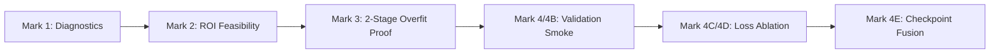

# Liver CT Scan Dataset & Quality Assurance Platform (LiTS-17)

[](https://competitions.codalab.org/competitions/17094)
[]()
[]()
[]()
[]()
[]()

> **Master Reference & Canonical Build**: `build_corrected_20260713_214847_v2`  
> **Manifest SHA-256**: `575a6fc391d63dc9bbbbb3317efe4d0f65edd57457ae63c1bfc6c2c615861889`  
> **Repository Purpose**: Rigorous Exploratory Data Analysis (EDA), Spatial Forensics, Pre-training Characterization, and 2-Stage Liver Tumor Segmentation Benchmarks.

---

## Interactive Documentation Hub

Click on any hyperlinked topic below to navigate directly to its dedicated, in-depth Markdown specification:

| Focus Area | Direct Interactive Document Link | Key Content & Embedded Visualizations |
| :--- | :--- | :--- |
| **Cohort Provenance** | [Dataset Identity & Acquisition](docs/DATA_PROVENANCE_AND_ACQUISITION.md) | Kaggle & HF mirrors, acquisition logs, NIfTI decompression, cryptographic hashes |
| **Spatial Forensics** | [Spatial Orientation & Quality Audit](docs/SPATIAL_ORIENTATION_AND_FORENSICS.md) | 47 volume $180^\circ$ flip repairs, $4\times$ denominator fix, 100% ROI crop containment |
| **Radiometrics & HU** | [Radiometrics & HU Windowing Profile](docs/RADIOMETRICS_AND_HU_WINDOWING.md) | `[-160, +240] HU` windowing, attenuation histograms, tumor-minus-liver contrast |
| **Patient Splits** | [Patient-Disjoint Splits & Burden Analysis](docs/PATIENT_SPLITS_AND_BURDEN_ANALYSIS.md) | Train (104), Val (13), Test (14) split composition, slice density, tumor burden plots |
| **3D Lesions** | [Lesion Morphology & Size Quartiles](docs/LESION_MORPHOLOGY_AND_3D_QUARTILES.md) | 845 3D connected components, Q1–Q4 size stratification, spatial occupancy heatmaps |
| **Model Benchmarks** | [Architecture & Checkpoint Fusion Policy](docs/MODEL_BENCHMARKS_AND_FUSION_POLICY.md) | Mark 1 to Mark 4E evolution, 2-Stage ROI pipeline, Checkpoint Fusion gate results |
| **External Evaluation** | [3D IRCADb-01 External Benchmark](docs/EXTERNAL_VAL_3D_IRCADB.md) | 20 public CT scans, 2,827 slices, un-tuned out-of-domain clinical validation contract |

---

## Executive Summary

Medical image segmentation models often suffer from performance degradation due to hidden dataset artifacts, incorrect slice orientations, spatial denominator mismatches, and extreme class imbalance. 

This repository presents a **comprehensive data engineering, spatial forensics, and deep learning platform** built on the 131 primary abdominal CT scans of the **Liver Tumor Segmentation Challenge (LiTS-17)**. 

### Key Achievements:
- **Spatial Alignment Repair**: Identified and corrected **47 volume $180^\circ$ in-plane orientation flips** between slice images and target labels.
- **Metric Reconciliation**: Reconciled a $4\times$ tumor burden denominator error, correcting true mean training tumor burden to **`0.1003%`**.
- **100% ROI Containment**: Established a 2-stage bounding box crop pipeline achieving **`100%`** tumor pixel containment (`152,763 / 152,763` pixels).
- **Benchmark Milestone (Mark 4E)**: Developed a pixelwise maximum Checkpoint Fusion policy ($\text{Prob} = \max(P_{\text{control}}, P_{\text{recall\_loss}})$ @ threshold `0.70`) that passes all 6 validation continuation targets, achieving a Q1 small-lesion detection rate of **`50.57%`** and an empty-slice false positive rate of **`5.55%`**.

---

## 1. Dataset Overview & Key Metrics

The dataset comprises **131 annotated primary abdominal CT volumes** ($58,638$ axial slices) covering the liver and abdominal cavity.

| Parameter / Metric | Quantified Value | Description & Clinical Context |
| :--- | :---: | :--- |
| **Total Patient Volumes** | `131` | Volume IDs `0` through `130` |
| **Total Axial Slices** | `58,638` | Full axial depth coverage |
| **Slices per Volume** | `447.6 ± 274.2` | Range: `[74, 987]`, Median: `432` |
| **Native Resolution** | `512 x 512` | Standardized & rescaled to `256 x 256` |
| **Tumor-Positive Slices** | `7,169` (`12.23%`) | Axial slices with non-zero lesion annotations |
| **Zero-Tumor Volumes** | `13 / 131` (`9.92%`) | Patients with zero hepatic tumors |
| **Pixel Imbalance Ratio (BG:FG)** | `822 : 1` | Extreme foreground sparsity ($0.12\%$ tumor pixels) |
| **Overall Mean Tumor Burden** | `0.12%` | % of liver volume occupied by lesion (Max: `2.12%`) |
| **Data Integrity Rate** | `100%` | Zero corrupted files across all `175,914` image/mask PNGs |

---

## 2. Radiometric Hounsfield Unit (HU) Windowing

Abdominal CT scans express tissue density in **Hounsfield Units (HU)**. To isolate soft-tissue contrast within the liver parenchyma, attenuation values are clipped and scaled.

```
       [ -1000 HU ] ----------- [ -160 HU ... +240 HU ] ----------- [ +3000 HU ]
           Air                      Broad Abdominal Window               Bone / Contrast
                                (Parenchyma & Lesion Contrast)
```

### Preprocessing Profile: `HU[-160,240]_bilinear_image_nearest_mask_256`
- **Broad Window**: `[-160, +240] HU` mapped to $[0, 1]$ and stored as 8-bit grayscale PNGs ($256\times 256$).
- **Normalized Intensity Stats (0–255)**:
  * **Background Mean**: `44.4 ± 84.1`
  * **Tumor Tissue Mean**: `109.1 ± 102.1` *(Tumors appear hyper-intense post-windowing)*
  * **Median Tumor-minus-Liver Contrast**: `-34 HU` (Train), `-44 HU` (Validation)
  * **Robust Contrast-to-Noise Ratio (CNR)**: `-1.518` (Train), `-1.881` (Validation)

---

## 3. Patient-Aware Split Partitioning

To avoid data leakage across adjacent axial slices of the same patient scan, partitioning is enforced strictly at the **volume/patient level**.

| Split Name | Volume IDs | Volumes | Total Slices | Tumor-Positive Slices | Tumor-Positive % | Mean Tumor Burden % |
| :--- | :---: | :---: | :---: | :---: | :---: | :---: |
| **Train** | `0 – 103` | `104` | `40,667` | `4,930` | `12.12%` | `0.1003%` |
| **Validation** | `104 – 116` | `13` | `10,685` | `1,042` | `9.75%` | `0.0874%` |
| **Test (Locked)** | `117 – 130` | `14` | `7,286` | `1,197` | `16.43%` | `0.3071%` |
| **Total Cohort** | **`0 – 130`** | **131** | **58,638** | **7,169** | **12.23%** | **0.1218%** |

> [!NOTE]  
> The internal Test set (`14` volumes) is a **sealed, un-opened holdout** used strictly for one-time final evaluation to prevent dataset over-fitting. For details, see [Patient Splits & Burden Analysis](docs/PATIENT_SPLITS_AND_BURDEN_ANALYSIS.md).

---

## 4. 3D Lesion Morphology & Size Quartiles

Across the cohort, **845 distinct 3D connected lesion components** were extracted and categorized into train-derived volume quartiles. For full details, see [Lesion Morphology & Size Quartiles](docs/LESION_MORPHOLOGY_AND_3D_QUARTILES.md).

```
Distribution of 3D Lesion Volumes (Median: 0.383 mL, Max: 968.6 mL):

  Q1 (Small):       < 0.173 mL   | Diameter <= 6.92 mm  (Requires high-res feature maps)
  Q2 (Med-Small): 0.173 - 0.673 mL| Diameter 6.92 - 10.87 mm
  Q3 (Med-Large): 0.673 - 3.944 mL| Diameter 10.87 - 19.60 mm
  Q4 (Massive):     > 3.944 mL   | Diameter > 19.60 mm  (Up to 266.35 mL in Volume 116)
```

---

## 5. Model Architecture & Benchmark Milestones

The project followed a multi-stage experimental roadmap (`Mark 1` $\to$ `Mark 4E`). For full details, see [Architecture & Checkpoint Fusion Policy](docs/MODEL_BENCHMARKS_AND_FUSION_POLICY.md).



### Controlling Benchmark Results (Mark 4E Checkpoint Fusion)

To eliminate false-negative predictions on hypodense lesions, a **Checkpoint Fusion Policy** was deployed:
$$\text{Fused Probability} = \max(P_{\text{control}}, P_{\text{recall\_loss}})$$

| Evaluation Metric | Target Threshold | Mark 4E Result | Status Gate |
| :--- | :---: | :---: | :---: |
| **Mean Dice (9 Tumor-Positive Val Patients)** | $\ge 0.3329$ | **`0.3771`** | **PASS** |
| **V104 Patient Dice** | $\ge 0.0500$ | **`0.1166`** | **PASS** |
| **V116 Patient Dice** | $\ge 0.0100$ | **`0.0105`** | **PASS** |
| **Q1 Small Lesion Detection Rate** | $\ge 35.0\%$ | **`50.57%`** | **PASS** |
| **Positive Predicted-Empty Rate** | $\le 35.0\%$ | **`27.45%`** | **PASS** |
| **Empty-Slice False Positive Rate** | $\le 20.0\%$ | **`5.55%`** | **PASS** |

---

## 6. Consolidated Jupyter Notebooks

This repository includes **4 consolidated, fully documented Jupyter Notebooks** located in [`notebooks/`](notebooks/):

1. **[`01_LiTS_Exploratory_Data_Analysis.ipynb`](notebooks/01_LiTS_Exploratory_Data_Analysis.ipynb)**:  
   Complete EDA pipeline, slice depth distributions, radiometric HU intensity histograms, and tumor burden profiling.
2. **[`02_Spatial_Orientation_Forensics_and_Quality_Audit.ipynb`](notebooks/02_Spatial_Orientation_Forensics_and_Quality_Audit.ipynb)**:  
   Spatial rotation matrix forensics ($180^\circ$ orientation fixes for 47 volumes), denominator reconciliation ($512\times 512 \to 256\times 256$), and 3D ROI bounding box containment verification.
3. **[`03_Patient_Aware_Splits_and_Pretraining_Characterization.ipynb`](notebooks/03_Patient_Aware_Splits_and_Pretraining_Characterization.ipynb)**:  
   Patient-disjoint split manifests, 3D connected component extraction, lesion size stratification (Q1–Q4), and 3D IRCADb-01 external evaluation protocol.
4. **[`04_Model_Benchmarks_and_Checkpoint_Fusion.ipynb`](notebooks/04_Model_Benchmarks_and_Checkpoint_Fusion.ipynb)**:  
   Benchmark progression tracking, 2-stage predicted-liver segmentation architecture, loss ablations, and Mark 4E checkpoint fusion policy verification.

---

## 7. Project Directory Structure

```
├── README.md                              <- Primary repository documentation (this file)
├── dataset.md                             <- Master dataset technical reference manual
├── LITS_DATASET_EDA_GITHUB_CARD.md        <- Formatted GitHub Dataset Card
├── docs/                                  <- MODULAR DOCUMENTATION HUB
│   ├── DATA_PROVENANCE_AND_ACQUISITION.md <- Cohort origin & download logs
│   ├── SPATIAL_ORIENTATION_AND_FORENSICS.md<- 180-deg flip repairs & 4x denominator fix
│   ├── RADIOMETRICS_AND_HU_WINDOWING.md   <- Radiometric HU statistics & windowing
│   ├── PATIENT_SPLITS_AND_BURDEN_ANALYSIS.md<- Train/Val/Test volume split composition
│   ├── LESION_MORPHOLOGY_AND_3D_QUARTILES.md<- 845 3D connected component quartiles
│   ├── MODEL_BENCHMARKS_AND_FUSION_POLICY.md<- Mark 1 to 4E model benchmark gates
│   └── EXTERNAL_VAL_3D_IRCADB.md          <- 3D IRCADb-01 external evaluation protocol
├── figures/                               <- Visual charts, histograms & heatmaps
├── notebooks/                             <- Consolidated executable Jupyter notebooks
├── mark 1/                                <- Phase 1 experimental notebooks & outputs (Mark 1-4E)
├── mark 1 (part 2)/                       <- Phase 2 dataset characterization & step 00-21 roadmap
└── Practice/                              <- Historical EDA notebooks, audit logs & script evidence
```

---

## Citation & Acknowledgments

If you use this dataset audit framework, spatial orientation corrections, or preprocessing pipeline, please cite:

```bibtex
@dataset{lits17_ct_eda_audit2026,
  author = {Nayd Hurve},
  title = {LiTS-17 CT Dataset Quality Audit, Spatial Forensics, and Exploratory Data Analysis Platform},
  year = {2026},
  publisher = {GitHub},
  journal = {GitHub Repository},
  howpublished = {\url{https://github.com/Naydhurve3/LIVER-CT-SCAN-DATASET}}
}
```
