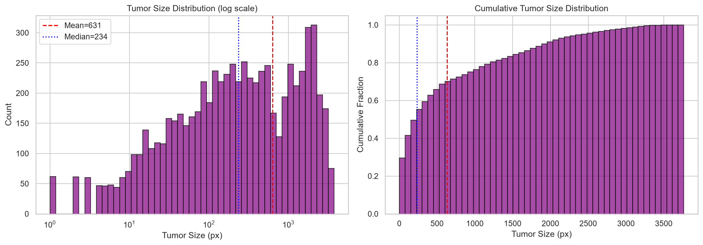
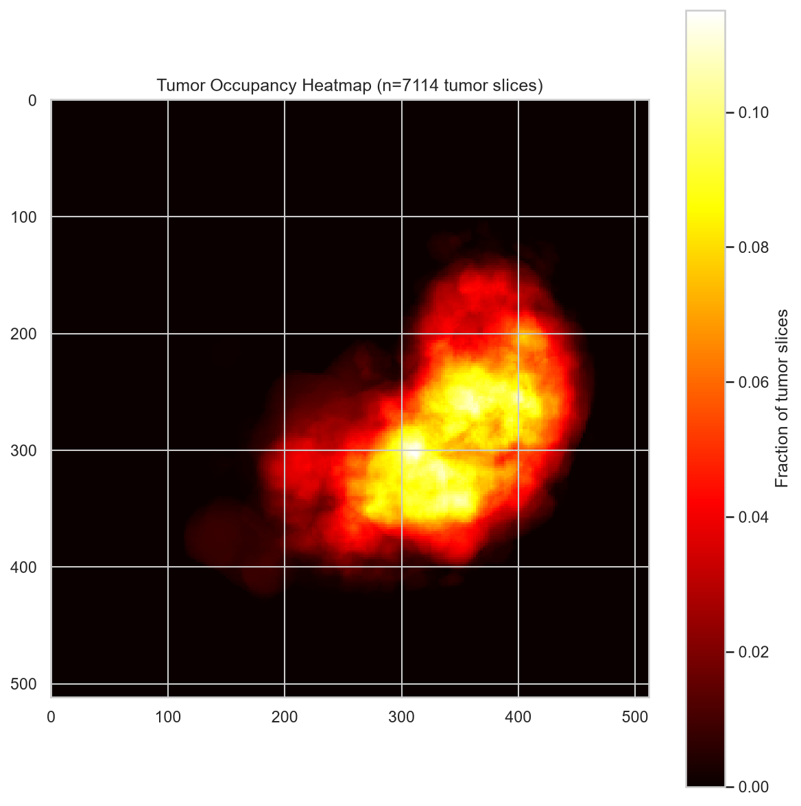

# 3D Lesion Morphology and Stratification Bins (Q1 – Q4)

> **Executable Notebook**: [`notebooks/03_Patient_Aware_Splits_and_Pretraining_Characterization.ipynb`](../notebooks/03_Patient_Aware_Splits_and_Pretraining_Characterization.ipynb)  
> **Source Script Reference**: [`mark 1 (part 2)/step_01_pretraining_dataset_characterization/step_01_pretraining_dataset_characterization.ipynb`](../mark%201%20(part%202)/step_01_pretraining_dataset_characterization/)

---

## 1. 3D Connected Component Extraction

Across the 131 CT volumes, **845 3D connected lesion components** were extracted using 6-connectivity:

$$V_{\text{physical}} = N_{\text{voxels}} \times \Delta x \times \Delta y \times \Delta z \quad (\text{mm}^3)$$

$$d_e = 2 \times \left( \frac{3 \times V_{\text{physical}}}{4 \pi} \right)^{1/3} \quad (\text{Equivalent Spherical Diameter in mm})$$

---

## 2. Train-Derived Lesion Stratification Bins (`train_derived_lesion_bins.json`)

To prevent validation data leakage, lesion size quartiles were fit strictly on the 637 training set lesions:

| Lesion Size Quartile | Volume Range ($V_L$) | Spherical Diameter ($d_e$) | Clinical Complexity & Detection Requirements |
| :--- | :---: | :---: | :--- |
| **Q1 (Very Small / Small)** | $(-\infty, 0.173\text{ mL}]$ | $(-\infty, 6.92\text{ mm}]$ | High-resolution feature retention; easily missed by standard downsampling |
| **Q2 (Medium-Small)** | $(0.173, 0.673\text{ mL}]$ | $(6.92, 10.87\text{ mm}]$ | Subtle parenchymal lesions |
| **Q3 (Medium-Large)** | $(0.673, 3.944\text{ mL}]$ | $(10.87, 19.60\text{ mm}]$ | Moderately defined focal lesions |
| **Q4 (Massive / Large)** | $(3.944, +\infty\text{ mL})$ | $(19.60, +\infty\text{ mm})$ | Extensive structural deformation (up to $266.35\text{ mL}$) |

---

## 3. Spatial Occupancy & Heatmap Analysis

Lesions exhibit preferential localization within the central hepatic parenchyma rather than peripheral borders.

---

## 4. Associated Notebooks & Technical Documents

- 📓 **[03_Patient_Aware_Splits_and_Pretraining_Characterization.ipynb](../notebooks/03_Patient_Aware_Splits_and_Pretraining_Characterization.ipynb)**
- 📄 **[mark 1 (part 2)/03_PRETRAINING_DATASET_AUDIT_CONTRACT.md](../mark%201%20(part%202)/03_PRETRAINING_DATASET_AUDIT_CONTRACT.md)**

---

[Previous: Patient Splits](PATIENT_SPLITS_AND_BURDEN_ANALYSIS.md) | [Back to Main README](../README.md) | [Next: Model Benchmarks](MODEL_BENCHMARKS_AND_FUSION_POLICY.md)
