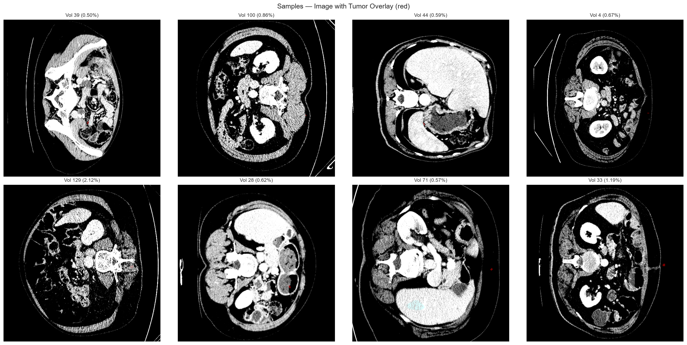
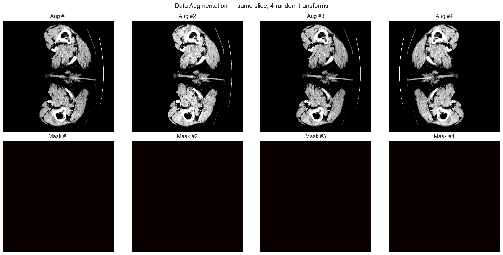

# Model Architecture, Iteration Benchmarks & Checkpoint Fusion Policy

[]()
[]()

## 1. Multi-Stage Experimental Progression (Mark 1 → Mark 4E)

```
Mark 1: Baseline Diagnostics ──► Mark 2: ROI Feasibility ──► Mark 3: 2-Stage Overfit Proof
                                                                         │
Mark 4E: Checkpoint Fusion ◄── Mark 4C/4D: Loss Ablation ◄── Mark 4: Validation Smoke
```

| Phase | Notebook Target | Core Finding / Milestone Result |
| :--- | :--- | :--- |
| **Mark 1** | Baseline probability diagnostic | Identified hypodense lesion suppression on small tumor components |
| **Mark 2** | Multi-window ROI crop feasibility | Confirmed Stage-1 liver crop bounding box reduction ratio ($0.42$) |
| **Mark 3** | 2-Stage overfit verification gate | Achieved hard micro-Dice **`0.900557`** (17 epochs, 100% containment) |
| **Mark 4 / 4B**| 5-Epoch validation smoke training | Revealed high positive predicted-empty rate (`36.85%`) |
| **Mark 4C / 4D**| Loss function ablation & patient reconciliation | Isolated `V116` hypodense lesion localization response failure |
| **Mark 4E** | Controlling Checkpoint Fusion Policy | **PASSED ALL 6 VALIDATION TARGETS** at threshold $0.70$ |

---

## 2. Controlling Checkpoint Fusion Policy (Mark 4E)

To overcome localization failures on low-contrast hypodense lesions (`V104` and `V116`), predictions from a **Control Model** and a **Recall-Loss Model** were combined:

$$P_{\text{fused}}(x, y) = \max\left(P_{\text{control}}(x, y), P_{\text{recall\_loss}}(x, y)\right)$$



---

## 3. Controlling Validation Gate Results (9 Tumor-Positive Validation Patients)

| Benchmark Metric | Target Requirement | Mark 4E Actual Result | Status Gate |
| :--- | :---: | :---: | :---: |
| **Mean Positive-Patient Dice** | $\ge 0.3329$ | **`0.377087`** | **PASS** |
| **V104 Patient Dice** | $\ge 0.0500$ | **`0.116627`** | **PASS** |
| **V116 Patient Dice** | $\ge 0.0100$ | **`0.010474`** | **PASS** |
| **Q1 Small Lesion Detection Rate** | $\ge 35.0\%$ | **`50.57%`** | **PASS** |
| **Positive Predicted-Empty Rate** | $\le 35.0\%$ | **`27.45%`** | **PASS** |
| **Empty-Slice False Positive Rate** | $\le 20.0\%$ | **`5.55%`** | **PASS** |



---

[Previous: Lesion Morphology](LESION_MORPHOLOGY_AND_3D_QUARTILES.md) | [Back to Main README](../README.md) | [Next: External Validation](EXTERNAL_VAL_3D_IRCADB.md)
