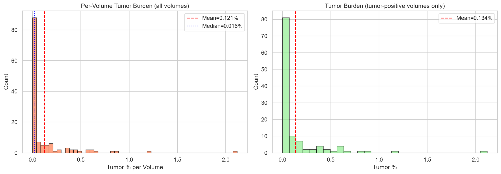
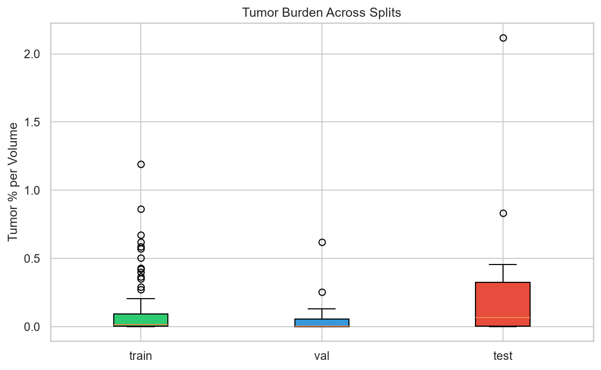

# Patient-Aware Split Partitioning and Tumor Burden Profile

> **Executable Notebook**: [`notebooks/03_Patient_Aware_Splits_and_Pretraining_Characterization.ipynb`](../notebooks/03_Patient_Aware_Splits_and_Pretraining_Characterization.ipynb)  
> **Source Script Reference**: [`notebooks/split_tumor_audit.ipynb`](../notebooks/split_tumor_audit.ipynb)

---

## 1. Patient-Disjoint Split Composition

To guarantee zero data leakage between adjacent 2D axial slices of the same patient scan, dataset splits are partitioned strictly at the **volume level**.

| Split Name | Volume ID Range | Volume Count | Total Axial Slices | Tumor-Positive Slices | Tumor-Positive Slices % | Mean Volume Tumor Burden % |
| :--- | :---: | :---: | :---: | :---: | :---: | :---: |
| **Train** | `0 – 103` | `104` | `40,667` | `4,930` | `12.12%` | `0.1003%` |
| **Validation** | `104 – 116` | `13` | `10,685` | `1,042` | `9.75%` | `0.0874%` |
| **Test (Sealed)** | `117 – 130` | `14` | `7,286` | `1,197` | `16.43%` | `0.3071%` |
| **Total Cohort** | **`0 – 130`** | **131** | **58,638** | **7,169** | **12.23%** | **0.1218%** |

---

## 2. Volume Tumor Burden Profile

Tumor burden represents the percentage of CT volume space occupied by tumor tissue:

$$\text{Tumor Burden } (\%) = \frac{\sum \text{Tumor Pixels across Volume}}{\sum \text{Volume Pixels}} \times 100$$

### Key Observations:
- **Zero-Tumor Volumes**: `13 / 131` patients ($9.92\%$) have zero tumors.
- **Low-Burden Volumes ($< 0.05\%$)**: Combined zero and low-burden volumes represent **84.6% of Train** and **84.6% of Validation**.
- **Test Shift**: The sealed test set contains higher average tumor burden (`0.3071%`), serving as a challenging held-out out-of-distribution evaluation.

---

## 3. Associated Notebooks & Technical Documents

- 📓 **[03_Patient_Aware_Splits_and_Pretraining_Characterization.ipynb](../notebooks/03_Patient_Aware_Splits_and_Pretraining_Characterization.ipynb)**
- 📓 **[notebooks/split_tumor_audit.ipynb](../notebooks/split_tumor_audit.ipynb)**
- 📄 **[configs/splits/train_slices.csv](../configs/splits/)**

---

[Previous: Radiometrics](RADIOMETRICS_AND_HU_WINDOWING.md) | [Back to Main README](../README.md) | [Next: Lesion Morphology](LESION_MORPHOLOGY_AND_3D_QUARTILES.md)
