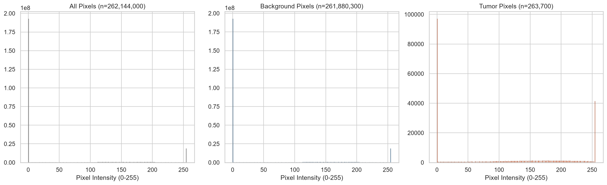

# Radiometric Hounsfield Unit (HU) Windowing and Intensity Analysis

[]()
[]()

> **Executable Notebook**: [`notebooks/01_LiTS_Exploratory_Data_Analysis.ipynb`](../notebooks/01_LiTS_Exploratory_Data_Analysis.ipynb)  
> **Source Script Reference**: [`Practice/organ_normalized_intensity_robustness_ablation.ipynb`](../Practice/organ_normalized_intensity_robustness_ablation.ipynb)

---

## 1. Principles of Hounsfield Unit (HU) Windowing

Computed Tomography (CT) measurements represent linear attenuation coefficients relative to distilled water ($0\text{ HU}$) and air ($-1000\text{ HU}$):

$$\text{HU} = 1000 \times \frac{\mu_{\text{tissue}} - \mu_{\text{water}}}{\mu_{\text{water}} - \mu_{\text{air}}}$$

Raw abdominal CT scans capture a wide dynamic range ($-1000\text{ HU}$ to $+3000\text{ HU}$). Isolating hepatic lesions requires targeted intensity windowing to suppress uninformative bone and air signals while maximizing soft tissue contrast.

```
       [ -1000 HU ] ----------- [ -160 HU ... +240 HU ] ----------- [ +3000 HU ]
           Air                      Broad Abdominal Window               Bone / Contrast
                                (Parenchyma & Lesion Contrast)
```

---

## 2. Standard Preprocessing Profile: `HU[-160,240]_bilinear_image_nearest_mask_256`

- **Broad Abdominal Window**: `[-160, +240] HU`
- **Min-Max Scaling**: Normalizes intensities linearly to $[0.0, 1.0]$, stored as 8-bit grayscale PNGs ($256\times 256$).
- **Image Interpolation**: Bilinear
- **Mask Interpolation**: Nearest-Neighbour (preserves integer class labels $0, 1, 2$).


---

## 3. Normalized Intensity Statistics (8-Bit Scale [0, 255])

Comparing pixel intensity distributions post-windowing demonstrates hyper-intensity of tumor regions relative to dark background tissue.



| Tissue Region / Parameter | Intensity Mean | Intensity Std | Median HU Value | Clinical Interpretation |
| :--- | :---: | :---: | :---: | :--- |
| **All Image Pixels** | `44.5` | `84.1` | — | Full axial image distribution |
| **Background / Parenchyma** | `44.4` | `84.1` | `+99 HU` (Train) | Abdominal soft tissue baseline |
| **Tumor Lesions** | **`109.1`** | **`102.1`** | `+67 HU` (Train) | Brighter attenuation post-windowing |
| **Tumor-minus-Liver Contrast** | — | — | **`-34 HU`** (Train) | Hypodense parenchymal lesions |
| **Robust Contrast-to-Noise (CNR)** | — | — | **`-1.518`** (Train) | Signal clarity index |

---

## 4. Associated Notebooks & Technical Documents

- 📓 **[01_LiTS_Exploratory_Data_Analysis.ipynb](../notebooks/01_LiTS_Exploratory_Data_Analysis.ipynb)**
- 📓 **[Practice/organ_normalized_intensity_robustness_ablation.ipynb](../Practice/organ_normalized_intensity_robustness_ablation.ipynb)**
- 📄 **[mark 1 (part 2)/step_01_pretraining_dataset_characterization/README.md](../mark%201%20(part%202)/step_01_pretraining_dataset_characterization/README.md)**

---

[Previous: Spatial Forensics](SPATIAL_ORIENTATION_AND_FORENSICS.md) | [Back to Main README](../README.md) | [Next: Patient Splits](PATIENT_SPLITS_AND_BURDEN_ANALYSIS.md)
