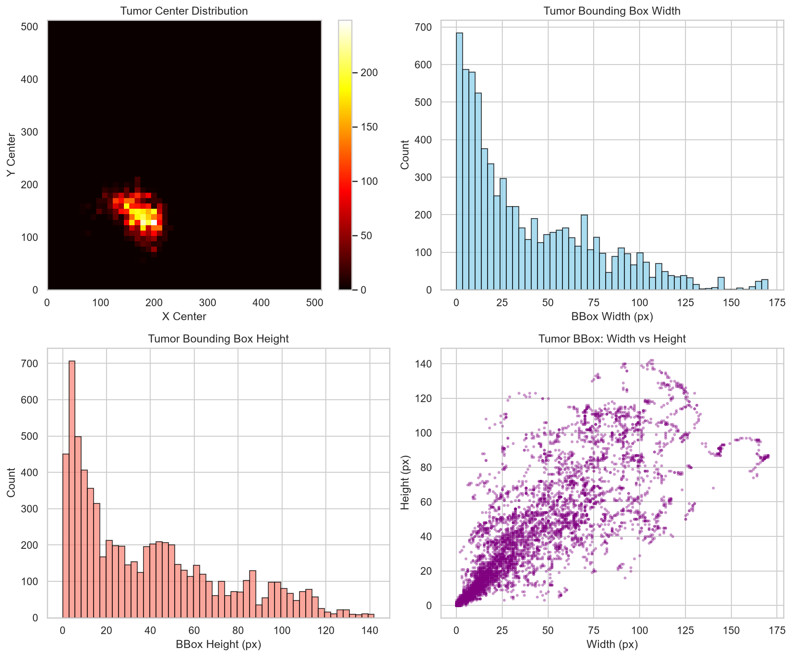

# Spatial Orientation Forensics, Denominator Reconciliation & Quality Audit

[]()
[]()

> **Executable Notebook**: [`notebooks/02_Spatial_Orientation_Forensics_and_Quality_Audit.ipynb`](../notebooks/02_Spatial_Orientation_Forensics_and_Quality_Audit.ipynb)  
> **Source Script Reference**: [`Practice/validation_volume_mask_orientation_forensics.ipynb`](../Practice/validation_volume_mask_orientation_forensics.ipynb)

---

## 1. Spatial Orientation Flips & Matrix Corrections

Auditing revealed that CT slice images and target segmentation masks in Kaggle Part 2 and Hugging Face mirrors suffered from a $180^\circ$ in-plane rotation flip.

```
       RAW ANOMALOUS ALIGNMENT (47 Volumes)           CORRECTED SPATIAL ALIGNMENT
       ┌───────────────────────────────────┐          ┌───────────────────────────────────┐
       │   Image Matrix    Mask Matrix     │          │   Image Matrix    Mask Matrix     │
       │     (Normal)       (Flipped)      │ ───────► │     (Normal)       (Normal)       │
       │     [  ▲  ]         [  ▼  ]       │ Rot180°  │     [  ▲  ]         [  ▲  ]       │
       └───────────────────────────────────┘          └───────────────────────────────────┘
```

### Planar Rotation Transformation Matrix:

$$\begin{bmatrix} x' \\ y' \\ 1 \end{bmatrix} = \begin{bmatrix} -1 & 0 & 255 \\ 0 & -1 & 255 \\ 0 & 0 & 1 \end{bmatrix} \begin{bmatrix} x \\ y \\ 1 \end{bmatrix}$$

- **`Identity` Matrix (84 Volumes)**: Volumes `0–82` and `100` (Original orientation retained).
- **`Rot180` Matrix (47 Volumes)**: Volumes `83–99` and `101–130` ($180^\circ$ planar rotation applied).


---

## 2. 4x Tumor Burden Denominator Reconciliation

$$\text{Legacy Burden } (\%) = \frac{\text{Tumor Pixels}}{512 \times 512 = 262,144} \times 100 = 0.0251\% \quad (\text{Deflated } 4\times)$$

$$\text{Reconciled Burden } (\%) = \frac{\text{Tumor Pixels}}{256 \times 256 = 65,536} \times 100 = 0.1003\% \quad (\text{True Native Burden})$$

* **Impact**: True mean training tumor burden was reconciled from `0.0251%` to **`0.1003%`**.

---

## 3. 2-Stage Bounding Box & ROI Containment Verification

To crop out unneeded background abdominal tissue, a 2-stage ROI extraction protocol was deployed:

1. Predict Stage-1 Liver probability mask at $0.50$ threshold.
2. Select the `largest_3d` connected liver component.
3. Apply $+16\text{px}$ spatial padding around the bounding box $[y_{\min}:y_{\max}, x_{\min}:x_{\max}]$.
4. Crop and resize to $256\times 256$.



* **Containment Verification**: Achieved **100% containment** of all tumor pixels across Train and Validation (`152,763 / 152,763` pixels in volume `V116`).

---

## 4. Associated Notebooks & Technical Documents

- 📓 **[02_Spatial_Orientation_Forensics_and_Quality_Audit.ipynb](../notebooks/02_Spatial_Orientation_Forensics_and_Quality_Audit.ipynb)**
- 📓 **[Practice/dataset_pairing_forensics.ipynb](../Practice/dataset_pairing_forensics.ipynb)**
- 📄 **[mark 1 (part 2)/01_PROJECT_AND_DATA_CONTEXT.md](../mark%201%20(part%202)/01_PROJECT_AND_DATA_CONTEXT.md)**

---

[Previous: Provenance](DATA_PROVENANCE_AND_ACQUISITION.md) | [Back to Main README](../README.md) | [Next: Radiometrics & HU Windowing](RADIOMETRICS_AND_HU_WINDOWING.md)
