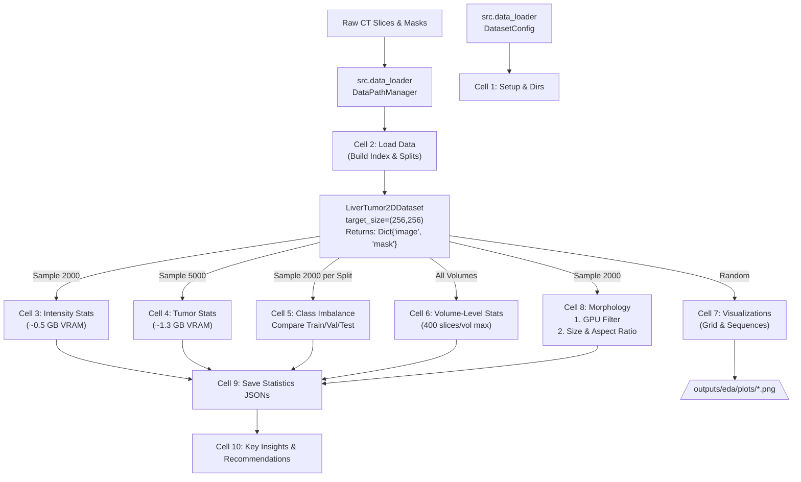

# Phase 2 EDA Notebook - Finalized Implementation Plan

All 3 gaps have been resolved! Here is the precise execution plan ready for notebook generation.

## 🌟 Gap Resolutions

1. **`target_size` Fix (`src/data_loader.py`)**
   * ✅ **FIXED**: I have successfully edited `_load_slice` in `src/data_loader.py` to correctly apply `PIL.Image.resize` (BILINEAR for images, NEAREST for masks) if the raw size differs from `target_size`.
2. **Morphology Bounding Box Logic (Gap 2)**
   * **Clarification**: In Cell 8, alongside `prop.area`, we will extract `prop.bbox` (min_row, min_col, max_row, max_col) from `skimage.measure.regionprops`. We'll compute the aspect ratio (`width / height`) and generate a scatter plot of `Size vs Aspect Ratio` to determine if tumors are elongated or spherical.
3. **Cell 5 Per-Split Analysis (Gap 3)**
   * **Clarification**: We will perform option **(b)** — comparing all 3 splits! We will loop over `['train', 'val', 'test']`, grab 2000 random slices from *each*, calculate their respective background-to-tumor ratios, and plot a grouped bar chart comparing the class imbalance across splits to verify there are no systematic biases in the val/test sets.

---

## 📊 EDA Process Workflow (Code Structure)



## 🗂️ Project Folder Structure

```text
Liver/
├── src/                              ← Centralized Python modules
│   ├── config.py
│   ├── data_loader.py                ← DataPathManager, DatasetConfig, LiverTumor2DDataset (Fixed Resizing)
│   ├── gpu_utils.py                  ← batch_to_tensor, gpu_clear_cache
│   └── ...
├── data/
│   ├── splits/                       
│   └── metadata/
│       └── phase2_statistics.json    ← Machine-readable (for Phase 3)
├── outputs/
│   └── eda/
│       ├── statistics.json           ← Human-readable EDA report
│       └── plots/                    ← 01_intensity_histogram.png, etc.
├── notebooks/                        
│   ├── 01_data_loading.ipynb         
│   └── 02_eda.ipynb
└── Dataset/                          ← EXTERNAL RAW DATA
```

## 🛠️ Execution Strategy (Cell-by-Cell)

| Cell | Focus | VRAM Strategy | Outputs |
|------|-------|---------------|---------|
| **1-2** | Setup & Indexing | Minimal (CPU string parsing) | `volume_index`, Split IDs |
| **3** | Intensity | `batch_to_tensor` on 2000 imgs (0.5GB). Call `gpu_clear_cache()`. | Histogram + Boxplot |
| **4** | Tumor Coverage | `batch_to_tensor` on 5000 masks (1.3GB). Call `gpu_clear_cache()`. | Coverage Histograms |
| **5** | Class Imbalance | 2000 masks per split sequentially. Clear VRAM between splits. | Pie Chart + Log Bar (All Splits) |
| **6** | Volume Stats | Max 400 slices per volume. Process volume-by-volume. | Boxplot + Scatter |
| **7** | Visualization | Loaded directly to Matplotlib via NumPy (CPU). | Random Grid, Volume Sequence |
| **8** | Morphology | GPU pre-filter to drop empty masks. CPU `skimage` extraction of `area` and `bbox`. | Size Histograms + Aspect Ratio Scatter |
| **9-10**| Reporting | Dictionary aggregation & Markdown printing. | JSONs + Key Insights Printout |

## Verification Plan
1. Open and execute `02_eda.ipynb`.
2. Confirm the 7 plots save correctly (including the new Aspect Ratio scatter).
3. Confirm both `statistics.json` files save.
4. Verify VRAM usage stays safely under 2GB throughout the notebook via `gpu_memory_report()`.

---

# Phase 3 Preprocessing Notebook — Implementation Plan

## Objective
Build a GPU-accelerated preprocessing pipeline for 2D PNG slices:
**HU Windowing → CLAHE → Resize → DataLoader Creation**

## Storage Locations
| Content | Directory |
|---------|-----------|
| Notebook | `notebooks/03_preprocessing.ipynb` |
| Plots | `outputs/preprocessing/plots/` |
| Config JSON | `outputs/preprocessing/preprocessing_config.json` |
| Input stats | `outputs/eda/statistics.json`, `outputs/eda/enhanced_volume_stats.json` |
| Split files | `data/splits/` |

## Cell-by-Cell Plan

| Cell | Title | What It Does | Uses `src/` |
|------|-------|-------------|-------------|
| 1 | GPU Setup & Phase 2 Stats | Import `DEVICE` + GPU utils from `src.gpu_utils`; load Phase 2 JSONs via `DatasetConfig` | `gpu_utils`, `data_loader.DatasetConfig`, `config` |
| 2 | Preprocessing Config | Dict-based config from `TRAIN_CONFIG_2D` + EDA stats | `config.TRAIN_CONFIG_2D` |
| 3 | HU Windowing | Import `hu_window_cpu`, `hu_window_batch` from `src.preprocessing`; run speed benchmark | `preprocessing` |
| 4 | CLAHE Enhancement | Import `CLAHEProcessor` from `src.preprocessing`; run speed benchmark | `preprocessing` |
| 5 | Resize & Batch | Import `resize_image`, `resize_mask`, `preprocess_batch_gpu` from `src.preprocessing`; run benchmark | `preprocessing` |
| 5b | Volume Index | Import `DataPathManager` from `src.data_loader`; build volume index | `data_loader` |
| 6 | Dataloaders | Import `LiverTumor2DDataset` + `create_2d_dataloaders` from `src.data_loader`; create train/val/test loaders | `data_loader` |
| 7 | Preprocessing Verification | Visualize raw → HU → CLAHE pipeline for random samples; save to `outputs/preprocessing/plots/` | `preprocessing`, `visualization` |
| 8 | Benchmark | GPU vs CPU benchmark across batch sizes `[1,4,8,16]` | `preprocessing`, `gpu_utils` |
| 9 | Save Pipeline | Export config JSON to `outputs/preprocessing/`; print summary report | — |

## Data Flow
```
Phase 2 JSONs ──> Cell 1: Load stats ──> Cell 2: Config dict
                                              │
Dataset PNGs ──> Cell 5b: DataPathManager ──> volume_index
                                              │
                                     Cell 6: create_2d_dataloaders
                                              │
                                     Cell 7: Verify pipeline visually
                                              │
                                     Cell 8: Benchmark GPU speedup
                                              │
                                     Cell 9: Save config JSON
```

## Key Design Decisions
1. **Config as dict** (not class) — simpler, directly JSON-serializable
2. **All preprocessing in `src.preprocessing`** — zero code duplication in notebook
3. **All data loading in `src.data_loader`** — `LiverTumor2DDataset` replaces `AugmentedDataset`
4. **Outputs go to `outputs/preprocessing/`** — separates from data and EDA outputs

## Refactoring Progress
- ✅ `DatasetConfig` missing attrs added to `src/data_loader.py`
- ✅ `01_data_loading.ipynb` imports fixed and save path corrected
- ✅ `03_preprocessing.ipynb` fully refactored to use `src/` modules
- ✅ `PreprocessingTransform` / `AugmentedPreprocessingTransform` classes added to `src/preprocessing.py`
- ✅ Full dataset dataloaders created (all 131 volumes, not truncated)
- ✅ `volume_index.pkl` cached for fast reload in Phase 4
- ✅ All paths made dynamic (no hardcoded machine-specific paths)
- ✅ Mask binarization bug fixed (masks are 0/1 not 0/255)
- ✅ Outdated docs archived to `docs/archive/`

---

# Phase 4: UP³RE-Net Research Implementation Plan

## Novel Architecture: Uncertainty-Propagated Per-Pixel Reweighting Ensemble Network

**Full name:** UP³RE-Net: Uncertainty-Propagated Per-Pixel Reweighting Ensemble Network for Imbalanced Medical Image Segmentation

**Acronym:** UP³RE (pronounced "u-prey")

## What It Does

Standard bagging trains models on bootstrap samples and averages them. Standard boosting re-weights training samples based on errors. **UP³RE-Net** goes further: it uses the **per-pixel disagreement** (variance) across the bagging ensemble to create a **per-pixel weight map**, then trains a fourth model with a novel **Uncertainty-Weighted Adaptive Compound Loss (UWACL)** that focuses on pixels where the ensemble disagrees most.

## Architecture Flow

```
STAGE 1: BAGGING ENSEMBLE (3 members)
┌─────────────────────────────────────────────────────────────┐
│  Train 3 × MobileNetV2U-Net on 3 stratified bootstrap       │
│  samples of the 104 train volumes                           │
│                                                              │
│  Bootstrap 1 ──→ MobileNetV2U-Net ──→ checkpoint (member 0) │
│  Bootstrap 2 ──→ MobileNetV2U-Net ──→ checkpoint (member 1) │
│  Bootstrap 3 ──→ MobileNetV2U-Net ──→ checkpoint (member 2) │
└─────────────────────────────────────────────────────────────┘
                            ↓
STAGE 1.5: UNCERTAINTY PRE-COMPUTATION
┌─────────────────────────────────────────────────────────────┐
│  Pass all 40,667 training slices through all 3 ensemble      │
│  members (sequential, for VRAM)                              │
│                                                              │
│  per-pixel σ² = variance(member0_pred, member1_pred,         │
│                          member2_pred)                       │
│                                                              │
│  Save to tmp/uncertainty/batch_{N:05d}.pt (500 MB total)    │
└─────────────────────────────────────────────────────────────┘
                            ↓
STAGE 2: UNCERTAINTY-GUIDED BOOSTING (★ NOVEL)
┌─────────────────────────────────────────────────────────────┐
│  Train 4th MobileNetV2U-Net with UWACL loss:                │
│                                                              │
│  w_ij = 1 + β·(1 - exp(-σ²_ij / τ_epoch))                  │
│  L = (1/N) · Σ w_ij · [λ₁·BCE + λ₂·Dice]                   │
│                                                              │
│  Where β=5.0, τ decays from 0.1 → 0.01 over epochs         │
│                                                              │
│  Result: model focuses on high-uncertainty pixels           │
└─────────────────────────────────────────────────────────────┘
                            ↓
STAGE 3: ENSEMBLE INFERENCE
┌─────────────────────────────────────────────────────────────┐
│  Final output = weighted avg of 4 models                    │
│  Output: segmentation mask + per-pixel confidence map       │
│  Models loaded sequentially to fit 4GB VRAM                 │
└─────────────────────────────────────────────────────────────┘
```

## Patent Claims (filed in `docs/RESEARCH_NOVELTY.md`)

| Claim | Novelty | File Location |
|-------|---------|---------------|
| 1 | Method: bagging → per-pixel uncertainty → UWACL boosting | `trainer.py` |
| 2 | Weight function: `w = 1 + β·(1 - exp(-σ²/τ))` | `losses.py:UncertaintyWeightedLoss` |
| 3 | Uncertainty-weighted compound loss (BCE + Dice) | `losses.py:UncertaintyWeightedLoss` |
| 4 | Dynamic threshold scheduling (τ decay) | `trainer.py:UncertaintyGuidedTrainer` |
| 5 | Mutual consistency regularization | `trainer.py` |
| 6 | End-to-end: segmentation + confidence map | `models.py:EnsembleWrapper` |

## Prior Art Gap

| Published | Their Approach | Our Distinction |
|-----------|---------------|-----------------|
| Two-layer ensemble (Springer 2024) | 1st layer predictions → augmentation | We use **uncertainty** (variance), not predictions |
| Deep ensemble + novel loss (CompBioMed 2024) | Slice-level sampling + exponential loss | Per-pixel weighting from **ensemble disagreement** |
| UCTNet (2024) | Uncertainty → CNN vs Transformer routing | Uncertainty → **loss re-weighting** |
| UG-CEMT (WACV 2025) | Semi-supervised mean teacher | Fully supervised, different architecture |

## Files to Build

| File | Lines | Key Classes |
|------|-------|-------------|
| `src/losses.py` | 80 | `DiceLoss`, `CombinedLoss`, `UncertaintyWeightedLoss` (UWACL) |
| `src/metrics.py` | 60 | `dice_coefficient`, `iou_score`, `ensemble_uncertainty`, `calibration_error` |
| `src/models.py` | 280 | `MobileNetV2UNet`, `EnsembleWrapper`, `MODEL_REGISTRY`, `create_model()` |
| `src/trainer.py` | 220 | `Trainer`, `UncertaintyPrecomputer`, `UncertaintyGuidedTrainer` |
| `src/config.py` | +15 | `PHASE4_RESEARCH_CONFIG` |
| `src/__init__.py` | +6 | New exports |
| `notebooks/04_research_training.ipynb` | ~300 code cells | 8-cell research pipeline |

## Time Budget

| Step | Epochs | ms/step | Steps | Real Time |
|------|--------|---------|-------|-----------|
| 3× bagging MNV2 (sequential) | 25 each | 54 | 5,083 | 6.3 hrs |
| Uncertainty pre-computation | — | 162 | 5,083 | 20 min |
| Boosted MNV2 with UWACL | 25 | 54 | 5,083 | 2.1 hrs |
| Evaluation + figures | — | — | — | 30 min |
| **Total** | | | | **~9.2 hrs** |

## Key Technical Decisions

1. **No TinyUNet, No Plain UNet, No EfficientNetB0** — single architecture (MobileNetV2U-Net) for clean ablation
2. **Stratified bootstrap** — each sample forced ≥1 tumor-positive volume (prevents all-zero ensemble)
3. **Pre-computed uncertainty** — batch-level .pt files, loaded during Stage 2 training (saves 8 hrs)
4. **Sequential ensemble inference** — models swapped in/out of VRAM (each ~0.6 GB × 4 ≠ 4 GB simultaneous)
5. **Dynamic τ decay** — uncertainty temperature 0.1→0.01 linear over 25 epochs (Claim 4)
6. **batch-level fallback** — if GPU OOM (mem > 3.5 GB), skip batch + empty cache + warn

## Notebook Cell Summary

| Cell | What It Does | Time |
|------|-------------|------|
| 0 | Setup: `pip install timm`, imports, seed, device | — |
| 1 | Load `volume_index.pkl` + splits → 3 bootstrap loaders + val + test | 2 min |
| 2 | Stage 1: Train 3 × MNV2U-Net (25 ep each) | 6.3 hrs |
| 3 | Pre-compute uncertainty: ensemble on train set → batch .pt files | 20 min |
| 4 | Stage 2: Train 4th MNV2U-Net with UWACL (25 ep) | 2.1 hrs |
| 5 | Evaluate: Single vs Bagging vs UP³RE Full (Dice, IoU, ECE) | 20 min |
| 6 | Ablation: UWACL vs standard CombinedLoss | 10 min |
| 7 | Figures: bar chart, uncertainty maps, calibration plot | 10 min |
| 8 | Export: best model + save results + generate patent draft | — |

## Research Outputs

- **Comparison table**: Single member vs Bagging (3 avg) vs UP³RE Full (4 avg)
- **Ablation table**: UWACL vs CombinedLoss → Dice gain, IoU gain, ECE reduction
- **Uncertainty maps**: 6 test-set examples showing ensemble variance at error locations
- **Calibration plot**: Expected Calibration Error (ECE) for each method
- **Patent draft**: `outputs/research/patent_draft.md` with 6 claims
- **Export**: `models/upre/` — 4 checkpoints + inference config
