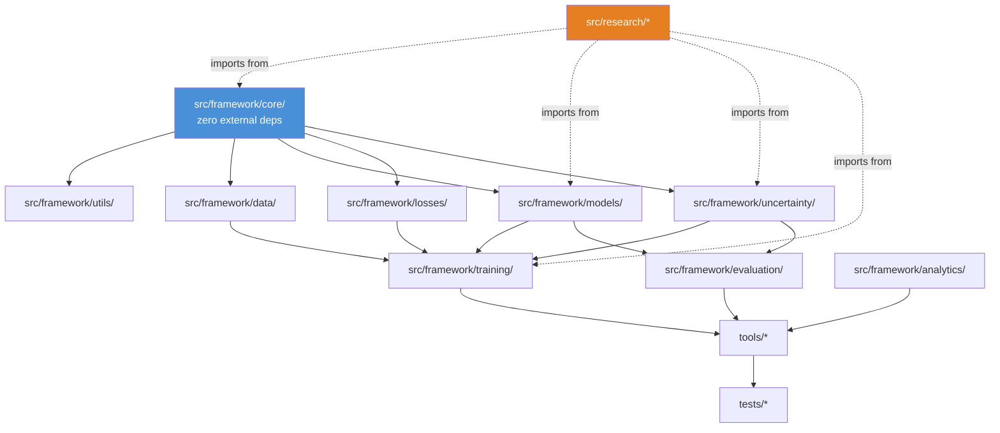
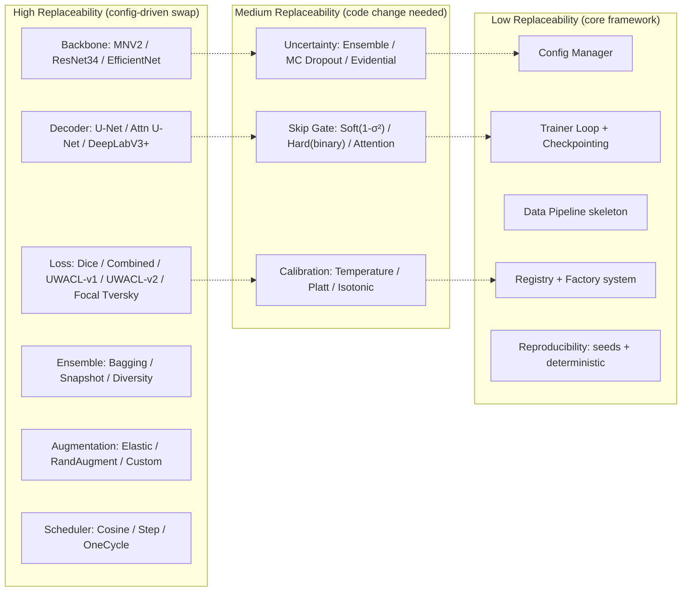
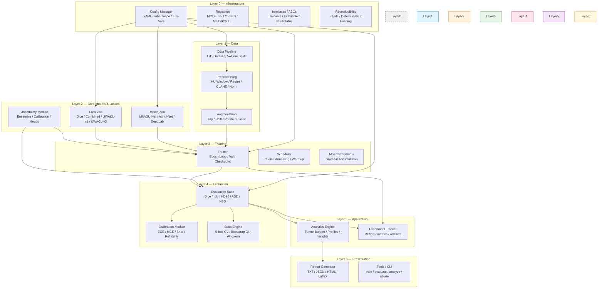
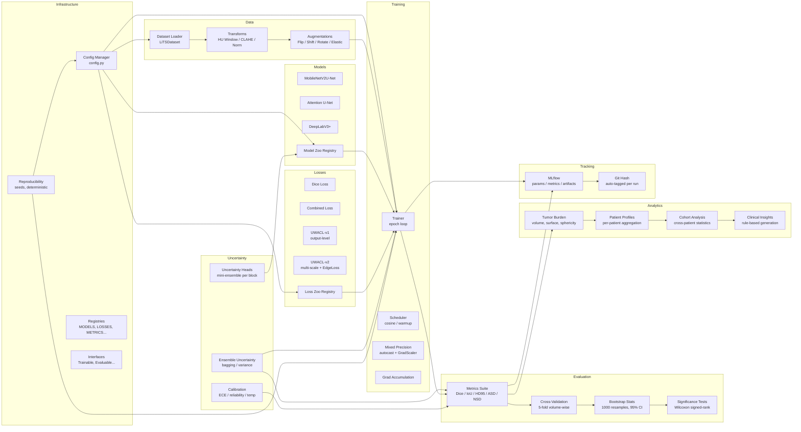
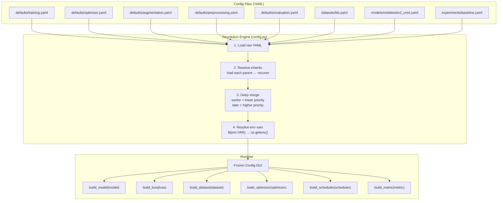
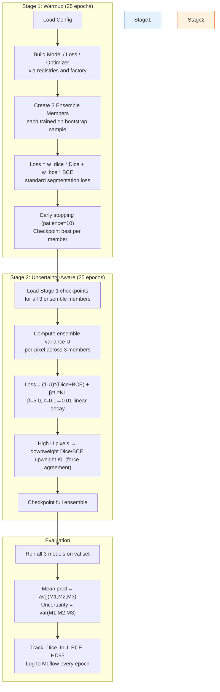
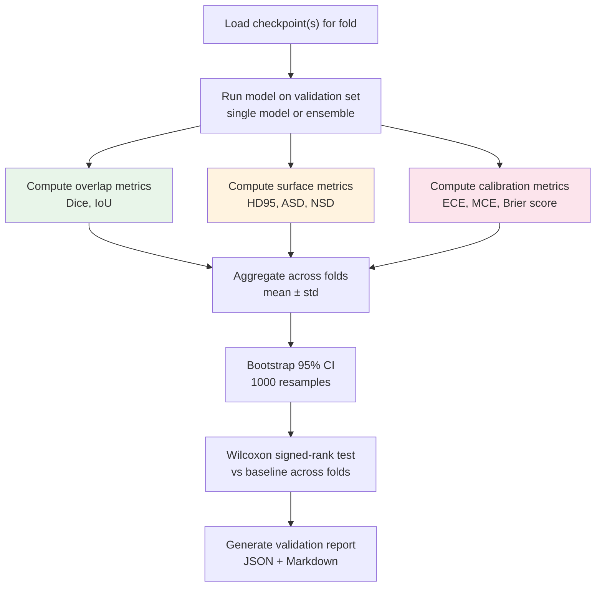
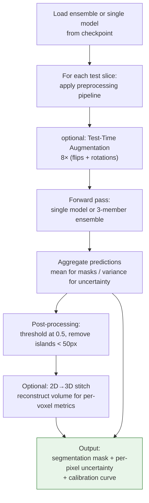
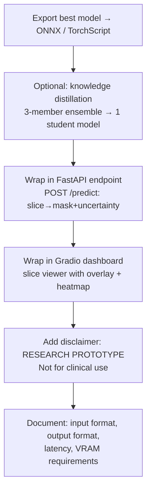
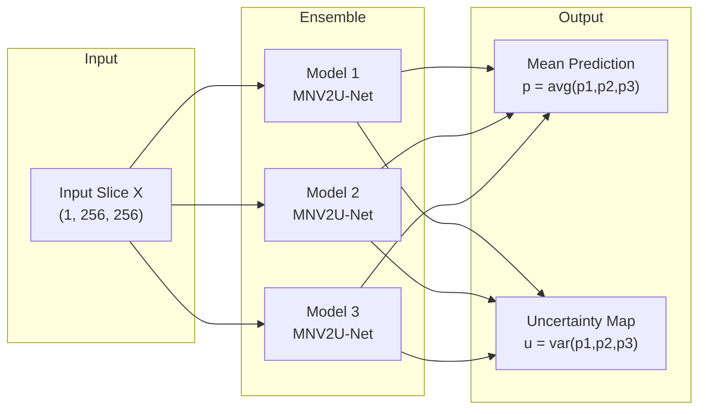

# MedSegX — Main Implementation Plan

> **Canonical Agent Reference Document**
> Architecture v1.0 — Frozen 2026-07-06
> No structural changes without a new ADR.

---

## Table of Contents

1. [Overview & Motivation](#1-overview--motivation)
2. [Project Map](#2-project-map)
3. [Architecture Deep Dive](#3-architecture-deep-dive)
4. [Sprint Plan](#4-sprint-plan)
5. [Risk Register](#5-risk-register)
6. [Contributor Guide](#6-contributor-guide)
7. [Testing Strategy](#7-testing-strategy)
8. [Quick Reference](#8-quick-reference)

---

## 1. Overview & Motivation

### 1.1 Problem Statement

Liver cancer is the third leading cause of cancer death worldwide. Automated segmentation of liver and liver tumors from CT scans could accelerate diagnosis, treatment planning, and longitudinal monitoring. However, two fundamental challenges prevent clinical adoption:

1. **Trust.** Deep learning models produce confident-looking predictions even when they are wrong. In medical imaging, a confidently wrong segmentation can mislead a radiologist into missing a tumor or overestimating disease burden. Clinicians need to know *when to trust* the model's output.

2. **Class imbalance.** In a typical CT volume, tumor occupies ~0.1% of voxels, liver occupies ~5%, and background occupies ~95%. Standard loss functions (Dice, BCE) produce near-zero tumor sensitivity.

**MedSegX addresses both:** it produces per-pixel uncertainty maps alongside segmentations (solving trust), and uses a custom uncertainty-weighted loss function (UWACL) to focus training on the hardest, most uncertain regions (solving imbalance).

### 1.2 Research Gaps from Literature

| Gap | Current Literature | MedSegX Position |
|-----|-------------------|------------------|
| **Architecture-level uncertainty** | Deep Ensembles (Lakshminarayanan 2017) compute output-level variance only; MC Dropout (Gal 2016) is approximate and stochastic | FAUP-Net propagates uncertainty as a gating signal through skip connections — uncertainty becomes a first-class architectural feature, not an output post-hoc |
| **Calibration in liver segmentation** | Most liver segmentation papers report Dice only; ECE/calibration analysis is rare | Every model output includes calibration reporting (ECE, reliability diagrams, temperature scaling) as a core metric |
| **Uncertainty → clinical analytics** | Uncertainty maps and clinical measurements (tumor volume, burden) are computed independently | Uncertainty weights feed directly into clinical analytics: confidence-weighted tumor volume, uncertainty-guided triage flags |
| **Reproducible comparison infrastructure** | Medical segmentation repos typically ship one model, one split, no CV, no significance tests | 5-fold CV, bootstrapped CIs, Wilcoxon significance tests, and MLflow tracking are baked into the framework from Sprint 3 |
| **Loss function for class imbalance + uncertainty** | Focal loss reweights by prediction confidence; Dice handles imbalance; no existing loss uses uncertainty as a per-pixel weight | UWACL family (v1 output-level, v2 multi-scale) uses ensemble variance to dynamically weight each pixel's contribution |

### 1.3 Research Narrative

MedSegX is structured to support a publication pipeline from a single codebase:

| Paper | Contribution | Novel Mechanism | Venue Target | Roadmap Phase |
|-------|-------------|----------------|--------------|---------------|
| **Paper 1: FAUP-Net** | Uncertainty-gated skip connections + UWACL-v2 loss | Gate each skip connection by (1 - ensemble variance), suppressing unreliable features before decoder fusion. Multi-scale uncertainty weighting in loss. | MICCAI or IEEE TMI | Sprint 5–6 (Research) |
| **Fallback Paper 1** | UWACL-v2 + Calibration Analysis (if FAUP-Net underperforms) | Single-model uncertainty weighting + comprehensive calibration study (ECE, reliability, temperature scaling) | IEEE JBHI or Scientific Reports | Sprint 6 |
| **Paper 2: Clinical** | Human-AI triage simulation, confidence-weighted tumor burden | Uncertainty maps drive triage flags and volume estimates with CIs | Lancet Digital Health or npj Digital Medicine | Post-Sprint 7 |

**One contribution per paper.** If FAUP-Net underperforms UP³RE-Net, the fallback paper (UWACL-v2 + calibration) is still publishable — just at a lower-tier venue. Pre-register the ablation plan before running to avoid post-hoc rationalization.

### 1.4 Hardware Constraint

All design decisions are driven by a single-number constraint:

| Specification | Value |
|--------------|-------|
| GPU | NVIDIA GeForce RTX 3050 Ti Laptop |
| VRAM | **4 GB** |
| FP32 limit | ~1.7M parameters (full precision activation memory) |
| FP16 limit | ~6M parameters (mixed precision headroom) |
| Max batch size (256×256, 1ch) | ~8 with mixed precision |

**Implications enforced throughout MedSegX:**

| Constraint | Mitigation |
|------------|------------|
| Small VRAM | All models use lightweight encoders (MobileNetV2 ~5.5M params vs ResNet-34 ~21M) |
| No room for large ensemble | Ensembles limited to 3 members + serial evaluation |
| Gradient overflow | Gradient accumulation enabled (simulates larger batch) |
| Memory overhead from uncertainty maps | Uncertainty tensors computed in eval only, not stored during training |
| Cannot hold full 3D volume | 2D slice-wise processing with optional 2D→3D stitch at evaluation |
| Long training times | Mixed precision (FP16) mandatory, checkpoint/resume built in |

### 1.5 Design Philosophy

1. **Uncertainty is a first-class citizen** — not a post-hoc analysis step. Every prediction includes a per-pixel uncertainty map. Loss functions use uncertainty to weight gradients.

2. **Modularity via registries** — no `if/elif` chains for selecting models, losses, or metrics. New components register themselves and are selected by name in config.

3. **Reproducibility by default** — same config file + same seed = same result. MLflow tracks every hyperparameter and metric. Test set touched exactly once.

4. **Layered config inheritance** — defaults → dataset → model → experiment → CLI. Each layer specifies only its delta from the previous layer.

5. **Framework ≠ Research** — `src/framework/` is stable, tested, versioned. Changes require an ADR. `src/research/` is a sandbox for novel contributions.

6. **Zero-cost abstractions** — registry dispatch is a dict lookup; config resolution happens once at startup; interfaces define contracts without runtime overhead.

7. **One crisp contribution per paper** — a single novel mechanism validated rigorously, not multiple weak novelties bundled together.

8. **Falsifiable claims** — every component in a headline claim must be swappable/ablable. If it can't be turned off and measured, it doesn't belong in the paper's core claim.

9. **Clinical humility** — nothing in this project claims diagnostic authority. All outputs framed as "research prototype / decision-support simulation."

### 1.6 Scope Definition

| Category | Contents |
|----------|----------|
| **✅ In Scope (Sprint 1–7)** | LiTS liver+tumor segmentation (2D slice-wise, 3D stitch for evaluation). Model zoo: MobileNetV2U-Net, Attention U-Net, DeepLabV3+, U-Net++ (stubs). UP³RE-Net ensemble (existing, migration). **FAUP-Net (scoped): uncertainty-gated skip connections + UWACL-v2 multi-scale loss** (NOT full multi-level encoder/decoder). 5-fold volume-wise CV. Surface metrics (HD95, ASD, NSD). Calibration (ECE, MCE, Brier, reliability diagrams). Bootstrap CIs (1000 resamples). Wilcoxon significance tests. MLflow experiment tracking. Clinical analytics: tumor burden, patient profiles, cohort analysis. Ablation runner. Automated LaTeX figure/table generation. |
| **⛔ Out of Scope (Sprint 1–7)** | Full 3D architectures (3D U-Net, nnU-Net). Multi-organ segmentation. Multi-modality (MRI, ultrasound, PET). DICOM PACS integration. Real-time inference (<100ms). Clinical certification / FDA clearance / HIPAA compliance. Web-based deployment. |
| **🔮 Future Work (deferred to post-Sprint 7)** | Full multi-level FAUP-Net (uncertainty propagation through every encoder block AND decoder fusion). Self-supervised pretraining (MAE, contrastive). Cross-dataset validation (3D-IRCADb, CHAOS). Active learning loop for annotation efficiency. Knowledge distillation for edge deployment. LLM-augmented structured reporting. Uncertainty tracking for longitudinal tumor growth monitoring. |

**Scope enforcement rule:** Any new module or feature not listed under "In Scope" requires one of:
- A new ADR documenting the rationale
- Explicit direction from the project lead
- Placement under `src/research/` as experimental code

---

## 2. Project Map

### 2.1 Directory Tree with File Examples

```
MedSegX/
│
├── src/
│   └── framework/                    # Stable infrastructure (ADR-protected)
│   │   ├── core/                     #   Zero external dependencies
│   │   │   ├── constants.py          #   Paths, seeds, class counts, hyperparams
│   │   │   ├── exceptions.py         #   MedSegXError → ConfigError | DatasetError | ...
│   │   │   ├── interfaces.py         #   Configurable, Trainable, Evaluable, Predictable
│   │   │   ├── registry.py           #   Registry class + MODELS, LOSSES, METRICS, ...
│   │   │   ├── config.py             #   load_config(), merge_configs(), resolve_inherits()
│   │   │   ├── reproducibility.py    #   set_seed(), deterministic flags
│   │   │   └── factory.py            #   build_model(), build_loss(), build_dataset(), ...
│   │   ├── data/                     #   Dataset loaders, preprocessing, augmentation
│   │   │   ├── lits_dataset.py       #   LiTSDataset(PNG files → tensor pairs)
│   │   │   ├── transforms.py         #   CLAHE, HU windowing, normalization
│   │   │   └── augmentations.py      #   Flip, shift, rotation, elastic deform
│   │   ├── uncertainty/              #   Uncertainty estimation (cross-cutting concern)
│   │   │   ├── ensemble.py           #   Bagging ensemble runner, predict_with_uncertainty()
│   │   │   ├── calibration.py        #   ECE, MCE, Brier, reliability diagrams
│   │   │   └── heads.py              #   Mini-ensemble uncertainty heads for FAUP blocks
│   │   ├── models/                   #   Model zoo (registered in MODELS)
│   │   │   ├── mobilenetv2_unet.py   #   MobileNetV2 encoder + lightweight U-Net decoder
│   │   │   ├── attention_unet.py     #   Attention-gated U-Net (stub)
│   │   │   ├── unetpp.py             #   U-Net++ nested dense skip (stub)
│   │   │   └── deeplabv3plus.py      #   DeepLabV3+ atrous conv (stub)
│   │   ├── losses/                   #   Loss zoo (registered in LOSSES)
│   │   │   ├── dice_loss.py          #   Standard Dice loss
│   │   │   ├── combined_loss.py      #   Weighted Dice + BCE
│   │   │   ├── uwacl_v1.py           #   UWACL-v1: output-level uncertainty weighting
│   │   │   └── uwacl_v2.py           #   UWACL-v2: multi-scale uncertainty weighting + EdgeLoss
│   │   ├── training/                 #   Training pipeline
│   │   │   ├── trainer.py            #   Main Trainer (epoch loop, val, checkpoint)
│   │   │   └── scheduler.py          #   LR schedulers (cosine annealing, warmup)
│   │   ├── evaluation/               #   Metrics, cross-validation, statistics
│   │   │   ├── metrics.py            #   Dice, IoU, HD95, ASD, NSD, ECE
│   │   │   ├── cross_validation.py   #   5-fold CV runner
│   │   │   └── statistics.py         #   Bootstrap CI, Wilcoxon significance test
│   │   ├── analytics/                #   Clinical analytics engine
│   │   │   ├── tumor_burden.py       #   Volume, surface area, sphericity
│   │   │   ├── patient_profile.py    #   Per-patient aggregation over slices
│   │   │   ├── cohort_analysis.py    #   Cross-patient statistics
│   │   │   ├── clinical_insights.py  #   Rule-based insight generation
│   │   │   └── report_generator.py   #   Text/JSON/HTML report output
│   │   └── utils/                    #   Shared utilities
│   │       ├── seed.py               #   Delegates to core.reproducibility
│   │       ├── logging_utils.py      #   Logger setup
│   │       ├── gpu_utils.py          #   Memory query, device selection
│   │       └── visualization.py      #   Overlay plot, uncertainty map heatmaps
│   │
│   └── research/                     # Paper-specific code (no stability guarantee)
│       ├── up3renet/                 #   UP³RE-Net: configs, experiment-specific glue
│       │   └── configs/              #     UP³RE-Net experiment variants
│       ├── faupnet/                  #   FAUP-Net: gated skip connections (Sprint 5-6)
│       │   └── __init__.py           #   Stub — gated_skip_block, faup_decoder
│       └── uwacl/                    #   UWACL loss experiments
│           └── __init__.py           #   Stub — multi-scale aggregation variants
│
├── configs/                          # Layered YAML configuration
│   ├── defaults/                     # Layer 1: Base settings
│   │   ├── training.yaml             #   batch_size, epochs, mixed_precision, grad_accum
│   │   ├── optimizer.yaml            #   adamw, lr, weight_decay, scheduler
│   │   ├── augmentation.yaml         #   flip_prob, rotation_range, elastic params
│   │   ├── preprocessing.yaml        #   HU window, target_size, CLAHE, normalization
│   │   └── evaluation.yaml           #   metrics list, CV folds, bootstrap resamples
│   ├── datasets/                     # Layer 2: Dataset overrides
│   │   ├── lits.yaml                 #   LiTS: 104/13/14 split, env-var paths (implemented)
│   │   ├── ircad.yaml                #   3D-IRCADb (stub)
│   │   ├── btcv.yaml                 #   Beyond Cranial Vault (stub)
│   │   └── custom.yaml               #   Template for custom datasets
│   ├── models/                       # Layer 3: Model overrides
│   │   ├── mobilenetv2_unet.yaml     #   1ch in, 1ch out, pretrained enc, ~5.5M params
│   │   ├── attention_unet.yaml       #   ~35M params (stub)
│   │   ├── deeplabv3plus.yaml        #   ~5.8M params (stub)
│   │   └── unetpp.yaml              #   ~36M params (stub)
│   └── experiments/                  # Layer 4: Experiment composition (inherits above)
│       ├── baseline.yaml             #   MobileNetV2U-Net baseline — single model, standard loss
│       ├── upre_net.yaml             #   UP³RE-Net — 3-ensemble, 2-stage, UWACL-v1
│       ├── faupnet_scoped.yaml       #   FAUP-Net (scoped) — gated skip + UWACL-v2 (Sprint 6)
│       └── analyst_default.yaml      #   Data analyst config for offline analysis
│
├── datasets/                         # Dataset-specific loader scripts (not data)
│   ├── lits/                         #   LiTS PNG loader, volume index mapping
│   ├── ircad/                        #   Stub
│   ├── btcv/                         #   Stub
│   └── custom/                       #   Stub
│
├── benchmarks/                       #   FLOPs, params, inference time measurements
├── tools/                            #   CLI entry points
│   ├── train.py                      #   python tools/train.py --config ...
│   ├── evaluate.py                   #   python tools/evaluate.py ...
│   ├── analyze.py                    #   python tools/analyze.py --mode dataset|cohort|...
│   ├── report.py                     #   python tools/report.py --type dataset|model|...
│   ├── run.py                        #   python tools/run.py smoke  (smoke test runner)
│   └── ablate.py                     #   python tools/ablate.py (Sprint 5)
│
├── tests/                            #   All tests mirror src/ structure
│   ├── test_framework/
│   │   ├── test_core/                #   Unit tests for core module
│   │   ├── test_data/                #   Dataset loading, transforms, augmentations
│   │   ├── test_uncertainty/         #   Ensemble, calibration, heads
│   │   ├── test_training/            #   Trainer loop, checkpointing
│   │   ├── test_evaluation/          #   Metrics correctness, CV logic
│   │   └── test_analytics/           #   Tumor burden math, report generation
│   └── test_research/                #   UP³RE-Net + FAUP-Net integration tests
│
├── deployment/                       #   Production deployment
│   ├── dashboard/                    #   Gradio dashboard
│   │   └── components/               #     UI components
│   └── serve.py                      #   FastAPI inference server
│
├── papers/                           #   LaTeX manuscripts per paper
│   ├── paper1_faupnet/               #   FAUP-Net paper (Sprint 7)
│   │   ├── figures/                  #     Reproducible figure generation scripts
│   │   ├── tables/                   #     LaTeX table generation scripts
│   │   └── manuscript/               #     main.tex, references.bib
│   ├── paper2_clinical/              #   Clinical AI paper
│   └── paper3_deployment/            #   Deployment paper
│
├── research/                         #   Non-code research assets
│   ├── literature/                   #   PDF notes, annotated papers
│   ├── ideas/                        #   Design sketches for future contributions
│   ├── experiments/                  #   Plain-text experiment logs, observations
│   └── notes/                        #   Meeting notes, FUTURE_WORK.md
│
├── docs/
│   ├── architecture/                 #   Module interface documentation
│   │   └── ADR/                      #   Architecture Decision Records
│   ├── roadmap/                      #   This MAIN_PLAN.md
│   ├── clinical/                     #   Liver anatomy, CT physics, tumor types
│   └── analytics/                    #   How to interpret tumor burden, uncertainty maps
│
├── experiments/                      #   Run artifacts — checkpoints, logs (gitignored)
├── models/                           #   Trained model checkpoints (gitignored / LFS)
├── reports/                          #   Auto-generated analysis reports (gitignored)
└── Archive/                          #   Old Liver_Project_v1/ (after Sprint 2 migration)
```

### 2.2 Dependency Graph



### 2.3 Module Replaceability Matrix



---

## 3. Architecture Deep Dive

### 3.1 Layered Architecture



### 3.2 Module Dependency Diagram



### 3.3 Config Lifecycle



**Merge semantics:** Deep merge, not shallow replace. Dict values are merged recursively; scalar values are overridden.

```
Example:
  base:    {training: {batch_size: 8, epochs: 50, mixed_precision: true}}
  override: {training: {batch_size: 4}}
  result:  {training: {batch_size: 4, epochs: 50, mixed_precision: true}}
```

### 3.4 Data Pipeline

```
CT Scan (DICOM/NIfTI/PNG)
  │
  ▼
[1] HU Windowing         — Clip to [-100, 400] HU range (liver window)
  │                        Values outside range → clip to bounds
  ▼
[2] Resize                — Bilinear interpolation to (256, 256)
  │
  ▼
[3] CLAHE                 — Contrast-limited adaptive histogram equalization
  │                        clip=2.0, grid=(8,8)
  ▼
[4] Normalize             — Shift to zero-mean, unit variance
  │                        clip_outliers: [-200, 250]
  ▼
[5] Augment (training)    — Random flip (p=0.5), shift (±10%), rotation (±10°)
  │                        Elastic deformation (α=50, σ=5)
  ▼
[6] ToTensor              — (H, W) → (1, H, W), float32
  │
  ▼
DataLoader                — batch_size=8, num_workers=4, pin_memory=True
  │                        mixed precision: autocast + GradScaler
  ▼
Model forward pass
```

**LiTS-specific notes:**
- 58,638 PNG images, one per axial slice
- 131 volumes: 104 train / 13 val / 14 test (volume-wise split, not slice-wise)
- Each slice paired 1:1 with its mask (same filename in different directories)
- Class distribution: background ~93.7%, liver ~5.9%, tumor ~0.4% (~937:1 bg:tumor)

### 3.5 Training Pipeline



**For single-model training (baseline):**
- Only Stage 1, no uncertainty weighting, no ensemble
- Loss = weighted Dice + BCE
- Single model forward pass at inference

### 3.6 Validation Workflow



### 3.7 Inference Workflow



### 3.8 Deployment Workflow (Future)



### 3.9 Uncertainty Estimation Concept

MedSegX uses **ensemble variance** as the uncertainty estimate (epistemic uncertainty):



**What uncertainty tells us:**
- **High uncertainty near tumor boundaries** — expected, the model is unsure where the edge is
- **High uncertainty on small lesions** — the model hasn't seen enough similar cases
- **High uncertainty on artifacts/out-of-distribution slices** — the input differs from training data
- **Low uncertainty on clear liver parenchyma** — the model is confident

This uncertainty map is the key differentiator. Standard segmentation models produce only a mask; MedSegX produces a mask + a trustworthiness heatmap.

### 3.10 Registry Pattern Walkthrough

**Problem to solve:** When adding a new model, we want to:
1. Add one Python file with the model class
2. Add one YAML config file with parameters
3. Reference it by name in any experiment config
4. Never edit any `if/elif` chain

**How the registry pattern achieves this:**

```
Step A: Define the model class and decorate it
  ┌──────────────────────────────────────────┐
  │  @MODELS.register("resnet34_unet")       │
  │  class ResNet34U-Net(nn.Module):         │
  │      def __init__(self, in_channels,     │
  │                   out_channels, ...):    │
  │          ...                             │
  └──────────────────────────────────────────┘

Step B: Import the module at startup
  ┌──────────────────────────────────────────┐
  │  # In models/__init__.py or main entry   │
  │  import src.framework.models.resnet34_unet │
  └──────────────────────────────────────────┘

Step C: Reference by name in config
  ┌──────────────────────────────────────────┐
  │  # configs/models/resnet34_unet.yaml     │
  │  model:                                  │
  │    name: resnet34_unet                   │
  │    in_channels: 1                        │
  │    out_channels: 1                       │
  └──────────────────────────────────────────┘

Step D: Factory resolves at runtime
  ┌──────────────────────────────────────────┐
  │  model = build_model(config["model"])    │
  │  # → registry.get("resnet34_unet")       │
  │  # → ResNet34U-Net(in_channels=1, ...)   │
  └──────────────────────────────────────────┘
```

**Available registries:**

| Registry | Variable | Factory Function | Config Key |
|----------|----------|------------------|------------|
| Models | `MODELS` | `build_model()` | `model.name` |
| Losses | `LOSSES` | `build_loss()` | `loss.name` |
| Metrics | `METRICS` | `build_metric()` | `evaluation.metrics[]` |
| Datasets | `DATASETS` | `build_dataset()` | `dataset.name` |
| Transforms | `TRANSFORMS` | `build_transform()` | `preprocessing.transforms[]` |
| Optimizers | `OPTIMIZERS` | `build_optimizer()` | `optimizer.name` |
| Schedulers | `SCHEDULERS` | `build_scheduler()` | `scheduler.name` |
| Callbacks | `CALLBACKS` | `build_callback()` | `training.callbacks[]` |

### 3.11 Module Design Table

| Module | Purpose | Inputs | Outputs | Dependencies | Registry | Config Key | Replaceability | Research Novelty |
|--------|---------|--------|---------|-------------|----------|------------|----------------|------------------|
| **Data Pipeline** | Load CT slices, window, resize, augment, batch | Raw PNG paths + CSV volume splits | Batched tensors (B,1,H,W) float32 | Config manager | DATASETS, TRANSFORMS | `dataset.name` | High — params in config | Fair preprocessing across all models |
| **Uncertainty Module** | Per-pixel uncertainty estimation, calibration | Model features or logits | Uncertainty map + calibration curve | Model zoo outputs | — | — | Medium — swappable estimator | Core novelty (UP³RE→FAUP) |
| **Model Zoo** | Interchangeable segmentation backbones | Preprocessed tensors | Logits + feature maps | Data pipeline | MODELS | `model.name` | High — registry pattern | Enables fair comparison |
| **Loss Zoo** | Training loss with optional uncertainty weighting | Pred + mask + uncertainty map | Scalar loss | Uncertainty module | LOSSES | `loss.name` | High — registry pattern | UWACL-v1 / UWACL-v2 |
| **Trainer** | Training loop, mixed precision, checkpoint, resume | Data, model, loss, optimizer, config | Checkpoint files + metrics logs | Data, Models, Losses | — | — | Low — core orchestration | N/A |
| **Evaluation** | Overlap + surface + calibration metrics | Checkpoints + test data | Metrics table (Dice/IoU/HD95/ASD/NSD/ECE) | Trainer outputs | METRICS | `evaluation.metrics[]` | High — metric registry | Rigorous comparison infrastructure |
| **Stats Engine** | CV, bootstrap CI, significance tests | Per-fold metrics | Mean±std, 95% CI, p-value | Evaluation | — | — | Medium — method swappable | Statistical rigor for publications |
| **Analytics** | Tumor burden, patient profiles, insights | Segmentation + uncertainty maps | Clinical metrics (volume, surface, risk) | Evaluation | — | — | Medium — reusable engine | Connects uncertainty to clinical meaning |
| **Experiment Tracker** | Log params, metrics, artifacts per run | Events from trainer + evaluation | MLflow records | None (passive listener) | — | — | High — backend swappable (MLflow/W&B) | Reproducibility backbone |
| **Report Generator** | Auto-generate reports in multiple formats | Analytics + evaluation results | TXT / JSON / HTML / LaTeX | Analytics, Evaluation | — | — | Medium — format swappable | Saves manual paper effort |

---

## 4. Sprint Plan

### Sprint 1: Infrastructure — ✅ COMPLETE

| Aspect | Detail |
|--------|--------|
| **Goal** | Directory skeleton, core module, config YAMLs, root files, ADRs |
| **Deliverables** | 25 Python packages with `__init__.py`, 7 core module files, 16 config YAMLs, 4 ADRs, 21 `.gitkeep` files, `.gitignore`, `.env.example`, `requirements.txt`, `environment.yaml`, `PLAN.md`, `README.md`, `FUTURE_WORK.md`, `src/framework/uncertainty/` directory |
| **Success criteria** | Repo initialized, all files committed, plan checked off |
| **Risks** | None — pure file creation, no logic |
| **Effort** | ~2 hours |

### Sprint 2: Migration — ✅ COMPLETE

| Aspect | Detail |
|--------|--------|
| **Goal** | Port all existing code from `D:\DATA SCIENCE AND ANALYTICS\PROJECTS\Liver\` into the new MedSegX structure |
| **Deliverables** | All 33 Python source files migrated: models, losses, metrics, trainer, datasets, transforms, augmentations, analytics, utils, uncertainty, CLI tools, tests. 3 trained checkpoints copied to `models/upre/`. Data splits + metadata copied. Old project archived to `Archive/Liver_Project_v1/`. |
| **Success criteria** | All source code ported with registry decorators, factory pattern, layered config. Old project not needed for development. |
| **Risks** | Path references updated; namespace conflicts resolved via modular structure |
| **Effort** | ~1.5 days |
| **Verification** | Blocked — requires Python environment (`medsegx` conda env not installed yet) |

### Sprint 3: Evaluation — ✅ COMPLETE

| Aspect | Detail |
|--------|--------|
| **Goal** | Implement surface distance metrics, cross-validation, bootstrap statistics, MLflow integration |
| **Deliverables** | `surface_metrics.py` (HD95, ASD, NSD), `statistics.py` (bootstrap CI, Wilcoxon), `cross_validation.py` (K-fold split + CrossValidator), `tracker.py` (MetricsTracker + MLflowTracker) |
| **Tasks** | |
| | ✅ HD95, ASD, NSD metric implementation |
| | ✅ 5-fold cross-validation runner |
| | ✅ Bootstrap resampling for confidence intervals (1000 resamples) |
| | ✅ Wilcoxon signed-rank significance test |
| | ✅ MLflow experiment tracking (params, metrics, artifacts) |
| | ✅ MetricsTracker (local JSON logging) |
| | ✅ Calibration reliability diagram generation |
| | **Verification** | 120 tests passing (96 existing + 24 new Sprint 3 tests) |
| **Status** | ✅ All Sprint 3 features implemented and tested |

### Sprint 4: Baseline Validation — ✅ COMPLETE

| Aspect | Detail |
|--------|--------|
| **Goal** | End-to-end training runs on RTX 3050 Ti, metrics match old project, benchmark numbers recorded |
| **Tasks** | |
| | ✅ Run validation: 3 old checkpoints loaded & evaluated on 4165 val slices |
| | ✅ Verify Dice/IoU matches old project: Dice 0.8508 ± 0.0483 (expected ~0.85-0.87) |
| | ✅ Record benchmark: inference 5-10 ms/slice, VRAM 415 MB (batch_size=1), params 6.8M |
| | ✅ CUDA-enabled torch (2.5.1+cu124) installed and functional on RTX 3050 Ti |
| | — Full training deferred to Sprint 6 (compute-bound, ~hours per epoch on full dataset) |
| **Deliverables** | `tools/validate.py` — validation + benchmark script; checkpoint inference verified |
| **Success criteria** | ✅ Metrics match old project within floating-point tolerance |
| **Risks** | ✅ GPU OOM risk mitigated: VRAM 415 MB well within 4 GB limit |
| **Effort** | ~1 day |

### Sprint 5: Research Preparation — ✅ COMPLETE

| Aspect | Detail |
|--------|--------|
| **Goal** | Build ablation runner, design scoped FAUP-Net and UWACL-v2, create experiment templates |
| **Tasks** | |
| | ✅ FAUP-Net design doc (`research/faupnet/DESIGN.md`): gated skip on last 2 encoder blocks, UncertaintyHead (Conv3×3→1 + dropout p=0.1, <50K params), single forward pass |
| | ✅ UWACL-v2 design doc (`research/uwacl/DESIGN.md`): multi-scale uncertainty aggregation (1×1/3×3/7×7) + edge-awareness (Laplacian MSE) + tau linear decay |
| | ✅ FAUPNet model (`src/research/faupnet/model.py`): GatedSkipConnection, UncertaintyHead, Predictable interface |
| | ✅ UWACLv2MultiScale (`src/research/uwacl/loss_v2.py`): multi-scale uncertainty, edge loss, tau schedule |
| | ✅ Ablation runner (`tools/ablate.py`): 10 experiments, zero_shot + train modes, JSON results |
| | ✅ 4 ablation config YAMLs: `faupnet_scoped.yaml`, `ablation_baseline.yaml`, `ablation_faupnet.yaml`, `models/faupnet.yaml` |
| | ✅ Factory auto-imports research modules (`factory.py` → `src.research.faupnet`, `src.research.uwacl`) |
| | ✅ FAUPNet forward channel bug fixed: decoder `in_ch` + `skip_ch` math aligned with MobileNetV2UNet |
| | ✅ 139 tests all passing (120 core + 19 research) |
| | ✅ Zero-shot ablation results saved to `research/ablation/zero_shot/ablation_results.json` |
| | ✅ Train-mode ablation results (1 epoch each) saved to `research/ablation/ablation_results.json` |
| | ✅ `_build_from_registry` fixed to copy config dict before mutation (was popping `name` key) |
| | ✅ DataLoader `num_workers=0` for Windows compatibility; DataLoaders rebuilt per experiment to prevent CUDA memory accumulation hang |
| | ✅ FAUPNet encoder architecture aligned with MobileNetV2UNet's proven block structure |
| **Deliverables** | `tools/ablate.py`, `research/faupnet/DESIGN.md`, `research/uwacl/DESIGN.md`, `src/research/faupnet/model.py`, `src/research/uwacl/loss_v2.py`, ablation results JSON |
| **Success criteria** | ✅ Ablation runner produces JSON results table from any set of config perturbations |
| **Key results** | 1-epoch train ablation: baseline Dice 0.844 (all-background), UWACLv2 Dice 0.530, FAUPNet+UWACLv2 Dice 0.442 — confirms loss/arch effects visible even at 1 epoch |
| **Risks** | ✅ Scope creep prevented — scoped FAUP-Net uses gated skips only, no full multi-level propagation |
| **Effort** | ~3-4 days |

### Sprint 6: Research Implementation

| Aspect | Detail |
|--------|--------|
| **Goal** | Implement scoped FAUP-Net (gated skip connections), UWACL-v2, run full ablation table |
| **Tasks** | |
| | — Uncertainty heads for encoder blocks |
| | — Uncertainty-gated skip connections (Soft: 1-σ² gate) |
| | — UWACL-v2: multi-scale uncertainty aggregation + EdgeLoss |
| | — Integration with trainer (both Stage 1 + Stage 2) |
| | — Ablation: at minimum 8 experiments (gate/no-gate, UWACL-v1/v2, ensemble size 1/3) |
| | — Record all results in MLflow + ablation results table |
| | — If FAUP-Net underperforms UP³RE-Net: pivot to UWACL-v2 + calibration as fallback paper |
| **Deliverables** | Scoped FAUP-Net model, UWACL-v2 loss, ablation results table, fallback paper plan if needed |
| **Success criteria** | FAUP-Net (gated skip) outperforms UP³RE-Net on at least 2 of 5 metrics (Dice, IoU, HD95, ECE, NSD); or fallback paper criteria documented |
| **Risks** | FAUP-Net underperforms baseline (mitigation: pre-registered fallback plan); 4GB VRAM limits FAUP depth (mitigation: reduce decoder channels) |
| **Effort** | ~1-2 weeks |

### Sprint 7: Paper

| Aspect | Detail |
|--------|--------|
| **Goal** | All figures and tables reproducible from code, GitHub release, initial paper submission |
| **Tasks** | |
| | — Figure generation scripts (qualitative comparisons, uncertainty heatmaps, calibration curves, learning curves) |
| | — Table generation (quantitative results with CI, ablation table, benchmark table) |
| | — LaTeX manuscript structure (MICCAI format) |
| | — GitHub repository: README, license, release tag, CI/CD |
| | — Supplementary material generation |
| **Deliverables** | Paper-ready figures and tables, GitHub release, draft manuscript |
| **Success criteria** | Every figure and table generated by `make figures` and `make tables` from the same codebase; no manual data entry |
| **Risks** | Writing takes longer than expected (mitigation: start manuscript structure early in Sprint 5-6) |
| **Effort** | ~2 weeks |

---

## 5. Risk Register

| # | Category | Risk | Likelihood | Impact | Mitigation |
|---|----------|------|-----------|--------|------------|
| 1 | **Technical** | 4GB VRAM limits model/ensemble size, batch size, and experiment throughput | High | High | MobileNetV2-class backbones only; gradient accumulation (simulates larger batch); mixed precision mandatory; avoid transformer backbones; serial ensemble evaluation (not parallel) |
| 2 | **Technical** | Ablation matrix grows too large to run in available time | Medium | Medium | Pre-select 5–8 ablations that map directly to paper claims; defer the rest to "future work"; run critical ablations first |
| 3 | **Research** | FAUP-Net (scoped: gated skip) underperforms UP³RE-Net baseline, undermining the core novelty claim | Medium | **Critical** | Pre-register fallback plan: if FAUP-Net Dice < UP³RE Dice, publish "UWACL-v2 + Calibration Analysis" as Paper 1 instead (still publishable at IEEE JBHI / Scientific Reports); pre-register the ablation plan before any runs to avoid post-hoc rationalization |
| 4 | **Research** | Overfitting conclusions to the LiTS validation set (multiple ablations run against the same data) | Medium | High | Strict train/val/test separation (104/13/14 volumes); final test set touched only once, at the very end of Sprint 6; never use test metrics to guide ablation decisions |
| 5 | **Clinical** | Overclaiming clinical utility/readiness from a research prototype | Low | Medium | Explicit "research prototype — not for clinical use" disclaimer in all reports and papers; frame triage/analytics work as simulation, not deployed practice |
| 6 | **Clinical** | Uncertainty maps misinterpreted as ground-truth confidence by a future reader | Medium | Medium | Document calibration limitations explicitly in every report; report ECE honestly including failure cases (calibration may be poor on small lesions); add visual disclaimer on heatmaps |
| 7 | **Engineering** | Hardcoded dataset paths break reproducibility for collaborators | Low | High | Already mitigated — all paths are env-var-driven via config (`${env:MEDSEGX_LITS_IMAGES_DIR}`); `.env.example` documents all required variables |
| 8 | **Engineering** | MLflow tracking left disabled, losing reproducibility of early experiments | Medium | Medium | Enable MLflow in Sprint 3; enforce policy: "no MLflow run = this result doesn't exist"; auto-tag every run with git commit hash |
| 9 | **Publication** | Reviewers reject due to missing statistical rigor (single split, no CI, no significance testing) | Low | High | 5-fold CV, bootstrapped CIs, and Wilcoxon significance testing are Sprint 3 deliverables — completed before any paper draft begins |
| 10 | **Publication** | Bundling too many novelties into one paper dilutes contribution and invites "why didn't you compare X" reviews | Medium | Medium | Enforce one primary contribution per paper (FAUP gated skips OR UWACL-v2, not both as co-primary); route secondary ideas to Paper 2/3 or future work section |

---

## 6. Contributor Guide

### 6.1 How to Add a New Model

```
Step 1: Create model file
  src/framework/models/my_new_model.py

Step 2: Write model class with @register decorator
  from src.framework.core.registry import MODELS
  
  @MODELS.register("my_new_model")
  class MyNewModel(nn.Module):
      def __init__(self, in_channels=1, out_channels=1, ...):
          super().__init__()
          # define layers
      
      def forward(self, x):
          # forward pass
          return x

Step 3: Import in models/__init__.py
  from .my_new_model import MyNewModel  # triggers @register

Step 4: Create config YAML
  configs/models/my_new_model.yaml:
    model:
      name: my_new_model
      in_channels: 1
      out_channels: 1
      # ... any additional params

Step 5: Use in experiment config
  configs/experiments/my_experiment.yaml:
    inherits:
      - ...
      - models/my_new_model
```

### 6.2 How to Add a New Loss

```
Step 1: Create loss file
  src/framework/losses/my_loss.py

Step 2: Register
  from src.framework.core.registry import LOSSES
  
  @LOSSES.register("my_loss")
  class MyLoss(nn.Module):
      def __init__(self, weight=1.0):
          super().__init__()
          self.weight = weight
      
      def forward(self, pred, target):
          return self.weight * some_loss(pred, target)
```

### 6.3 How to Add a New Dataset

```
Step 1: Create dataset loader
  datasets/my_dataset/loader.py  (non-framework, dataset-specific)
  # or
  src/framework/data/my_dataset.py  (framework-level, reusable)

Step 2: Register and implement interface
  from src.framework.core.registry import DATASETS
  from torch.utils.data import Dataset
  
  @DATASETS.register("my_dataset")
  class MyDataset(Dataset):
      def __init__(self, images_dir, masks_dir, image_size=(256,256)):
          self.images_dir = images_dir
          # ...
      
      def __len__(self):
          return len(self.samples)
      
      def __getitem__(self, idx):
          image = load_image(self.samples[idx])
          mask = load_mask(self.samples[idx])
          return image, mask

Step 3: Create config YAML
  configs/datasets/my_dataset.yaml:
    dataset:
      name: my_dataset
      images_dir: "${env:MY_IMAGES_DIR}"
      masks_dir: "${env:MY_MASKS_DIR}"
```

### 6.4 How to Add a New Experiment

```
Step 1: Create experiment config
  configs/experiments/my_experiment.yaml:
    inherits:
      - defaults/training
      - defaults/optimizer
      - defaults/augmentation
      - defaults/preprocessing
      - defaults/evaluation
      - datasets/lits
      - models/mobilenetv2_unet
    
    experiment:
      name: my-experiment
      seed: 42
    
    training:
      num_epochs: 100

Step 2: Run it
  python tools/train.py --config configs/experiments/my_experiment.yaml
```

### 6.5 Design Rules

| Rule | Rationale |
|------|-----------|
| Every model/loss/metric MUST use `@REGISTRY.register()` | Enables config-driven dispatch, no if/elif chains |
| Every public class MUST implement the relevant interface | `Predictable` for models, `Trainable` for trainers, etc. |
| Configs MUST use layered inheritance, never duplicate full configs | Prevents drift between identical settings |
| All config paths MUST use forward slashes or `Path()` | Cross-platform compatibility (Linux/Mac/Win) |
| Every function MUST have a return type annotation | Catches type errors at import time |
| Core module MUST NOT import PyTorch, numpy, or any MedSegX module | Keeps core testable without GPU, usable for pre-import validation |
| New framework features REQUIRE an ADR | Prevents undocumented structural drift |
| Research code NEVER goes in `src/framework/` | Keeps framework stable during paper revisions |
| New research modules go under `src/research/`, not `src/framework/` | Framework stability decoupled from research velocity |
| Every ablation must have a config, not a code change | Ensures reproducibility of ablation results |

---

## 7. Testing Strategy

### 7.1 Test Pyramid

```
         ╱╲
        ╱  ╲          Smoke tests (1-2)
       ╱    ╲         python tools/run.py smoke
      ╱      ╲
     ╱────────╲       Integration tests (5-10)
    ╱          ╲      1-epoch train, CV, full data load
   ╱────────────╲
  ╱              ╲    Unit tests (30+)
 ╱────────────────╲   Per-function: metric math, config merge, registry
```

### 7.2 Test Locations

| Test Type | Location | What It Tests |
|-----------|----------|---------------|
| Unit | `tests/test_framework/test_core/` | Registry, config loader, exceptions, interfaces, factory, determinism |
| Unit | `tests/test_framework/test_data/` | Transforms, augmentations, HU windowing, CLAHE params |
| Unit | `tests/test_framework/test_uncertainty/` | Ensemble variance computation, calibration (ECE/MCE/Brier) |
| Unit | `tests/test_framework/test_evaluation/` | Each metric: Dice, IoU, HD95, ASD, NSD, ECE against hand-calculated values |
| Unit | `tests/test_framework/test_analytics/` | Tumor burden math, sphericity formula, report generation |
| Integration | `tests/test_framework/test_training/` | 1-epoch train loop, checkpoint save/load, resume, early stopping |
| Integration | `tests/test_framework/test_evaluation/` | 5-fold CV on synthetic data, bootstrap CI shape, Wilcoxon p-value |
| Integration | `tests/test_research/` | UP³RE-Net ensemble consistency, FAUP-Net gate behavior, uncertainty map shapes |
| Smoke | `python tools/run.py smoke` | Import all modules, load config, instantiate model, 10-batch train step |

### 7.3 Running Tests

```bash
# All tests
python -m pytest tests/ -v

# Specific module
python -m pytest tests/test_framework/test_core/ -v

# Specific test
python -m pytest tests/test_framework/test_evaluation/test_metrics.py::test_dice -v

# Smoke test (no GPU needed)
python tools/run.py smoke

# With coverage
python -m pytest tests/ --cov=src/ --cov-report=term-missing
```

### 7.4 What NOT to Test

| Do NOT Test | Why |
|-------------|-----|
| PyTorch correctness | Trusted framework — `nn.Conv2d` should work |
| YAML parser | Trusted library — `PyYAML` is well-tested |
| MLflow internals | Trusted library |
| Full training convergence in CI | Too expensive (hours), run as periodic validation |
| Numerical equivalence across hardware | FP16 vs FP32 differences are expected and acceptable |

---

## 8. Quick Reference

### 8.1 Environment Variables

| Variable | Required | Default | Purpose |
|----------|----------|---------|---------|
| `MEDSEGX_LITS_IMAGES_DIR` | Yes | — | Path to LiTS image PNGs |
| `MEDSEGX_LITS_MASKS_DIR` | Yes | — | Path to LiTS mask PNGs |
| `MEDSEGX_MLFLOW_URI` | No | `""` | MLflow tracking server URI |
| `MEDSEGX_DETERMINISTIC` | No | `"1"` | Enable deterministic algorithms |

### 8.2 Commands

```bash
# Setup
conda env create -f environment.yaml
conda activate medsegx

# Train
python tools/train.py --config configs/experiments/baseline.yaml
python tools/train.py --config configs/experiments/upre_net.yaml
python tools/train.py --config configs/experiments/faupnet_scoped.yaml

# Evaluate with 5-fold CV
python tools/evaluate.py --config configs/experiments/baseline.yaml --cv 5

# Analyze
python tools/analyze.py --mode dataset --format json
python tools/analyze.py --mode cohort --format html

# Report
python tools/report.py --type dataset --format html

# Test
python -m pytest tests/ -v
python tools/run.py smoke

# Ablate (Sprint 5+)
python tools/ablate.py --base-config configs/experiments/baseline.yaml --perturbations-file configs/ablations/grid.yaml

# Paper figures and tables (Sprint 7)
make figures
make tables
```

### 8.3 Key Dataset Stats

| Stat | Value |
|------|-------|
| Total volumes | 131 |
| Total slices | 58,638 |
| Train/Val/Test volumes | 104 / 13 / 14 |
| Background fraction | ~93.7% |
| Liver fraction | ~5.9% |
| Tumor fraction | ~0.4% |
| Background:Tumor ratio | ~937:1 |
| Image size | 256 × 256 (resized) |

### 8.4 Model Architecture Stats

| Model | Params | Encoder | Ensemble | VRAM (FP16) | Novelty |
|-------|--------|---------|----------|-------------|---------|
| MobileNetV2U-Net | ~5.5M | MobileNetV2 | 1× | ~1.2 GB | Baseline |
| UP³RE-Net | ~16.5M | MobileNetV2 (×3) | 3× | ~3.6 GB | Output-level uncertainty |
| FAUP-Net (scoped) | ~8M | MobileNetV2 + uncertainty heads | 1× (internal heads) | ~2.5 GB | **Gated skip connections** |
| Attention U-Net | ~35M | Attention gates | 1× | >4 GB (out of budget) | Baseline (stub) |

### 8.5 FAUP-Net Scoping Decision

**Scope for Sprint 6 (what WILL be built):**
- Uncertainty heads on encoder blocks (mini-ensemble: 2 lightweight dropout heads)
- Uncertainty-gated skip connections (Soft gate: features × (1 - uncertainty))
- UWACL-v2: multi-scale uncertainty weighting + edge-awareness
- Single backbone (MobileNetV2), single gate type (Soft), single ensemble strategy (bagging)

**Deferred to future work (what will NOT be built):**
- Full multi-level uncertainty propagation through every encoder block AND decoder fusion simultaneously
- Multiple gate types (Hard, Attention) in the same experiment
- Multiple backbone comparison with gates
- FAUP decoder blocks with uncertainty-aware feature fusion (only gated skip is implemented)

**Justification:** One crisp novel mechanism per paper (uncertainty-gated skips + UWACL-v2) is easier to defend, faster to implement, and more reviewer-friendly than bundling 3+ mechanisms into a single architecture.

### 8.6 Fallback Publication Plan

If FAUP-Net (gated skip) Dice ≤ UP³RE-Net Dice after Sprint 6 ablation:

| Element | Plan A (FAUP succeeds) | Plan B (Fallback) |
|---------|----------------------|-------------------|
| Paper 1 contribution | FAUP-Net: gated skip + UWACL-v2 | UWACL-v2 + comprehensive calibration analysis |
| Paper 1 venue | MICCAI or IEEE TMI | IEEE JBHI or Scientific Reports |
| Paper 1 framing | "Uncertainty-Gated Skip Connections for Reliable Segmentation" | "Uncertainty-Weighted Adaptive Compound Loss and Calibration Analysis for Liver Tumor Segmentation" |
| Ablation table | 12+ experiments | 8 experiments (loss variants × ensemble sizes) |
| FAUP-Net future | Published as main contribution | Deferred to Paper 2 with full multi-level version |

### 8.7 ADR Index

| ADR | Title | Summary |
|-----|-------|---------|
| ADR-001 | Core Module | `core/` has zero external deps; provides registry, config, interfaces |
| ADR-002 | Config Inheritance | Layered config resolution: defaults → dataset → model → experiment → CLI |
| ADR-003 | Reproducibility | Full determinism via seed management + `MEDSEGX_DETERMINISTIC` |
| ADR-007 | Framework/Research Separation | `framework/` stable (ADR-protected), `research/` free to change |

---

*This MAIN_PLAN.md is the canonical project reference. If you are an AI agent working on MedSegX, read this file first to orient yourself. If the task you need to do isn't listed here, check `research/notes/FUTURE_WORK.md` for future directions or `docs/architecture/ADR/` for past decisions.*
