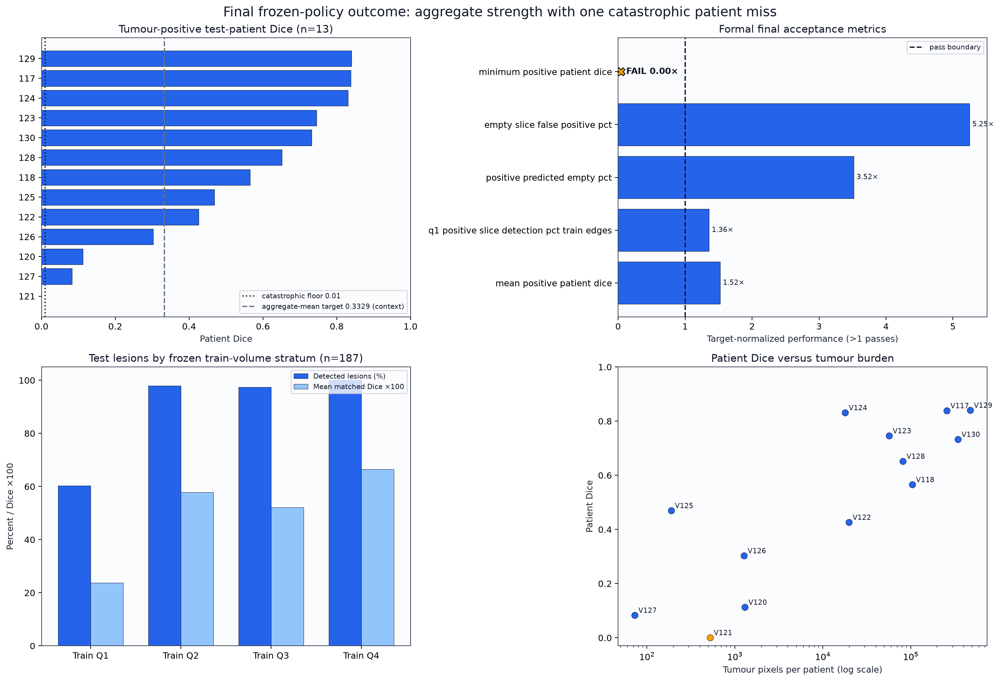
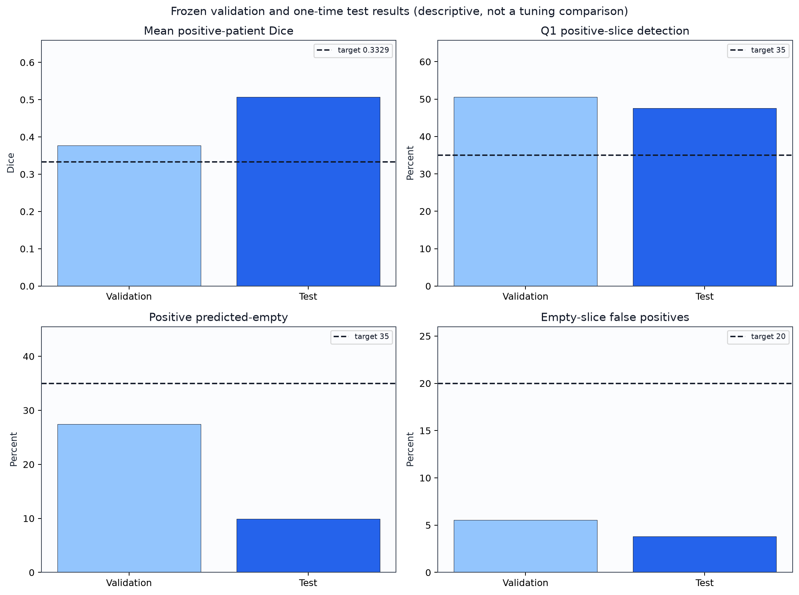
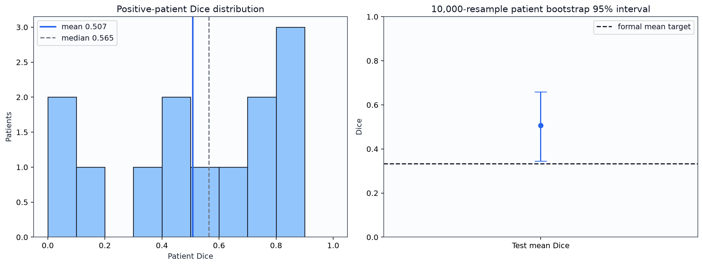

# Frozen LiTS Liver-Tumour Segmentation: Final Technical Report

## Technical summary

The project completed its one-time held-out test evaluation under a fully frozen two-checkpoint maximum-fusion policy. Aggregate performance was strong: global Dice was **0.7677**, mean Dice across 13 tumour-positive patients was **0.5073** (patient-bootstrap 95% interval **0.3442–0.6594**), global precision was **0.8444**, and global recall was **0.7038**.

Formal model acceptance nevertheless failed. V121 had effectively zero Dice, below the predeclared minimum-patient floor of 0.01. The final result is therefore **FINAL_TEST_COMPLETE with failed formal acceptance**, not deployment-ready model success. No test-driven tuning or rerun is permitted.

## Aggregate generalization coexisted with severe patient heterogeneity

The median positive-patient Dice was **0.5651**, but four of 13 positive patients scored below 0.3329. Large tumour-burden patients generally performed well, while very small or atypical cases produced unstable Dice. The one empty-tumour patient, V119, generated 968 false-positive pixels and is excluded from the positive-patient Dice mean but included in empty-slice false-positive reporting.

The figure pairs exact patient outcomes with the formal pass boundary. Orange marks V121, the sole mandatory acceptance failure.

## Small lesions remain the principal segmentation weakness

Train-derived lesion-volume Q1 contained 68 held-out lesions. Detection was **60.29%** and mean matched Dice was **0.238**. Detection rose to 98.00%, 97.37% and 100.00% for Q2–Q4. Slice-level Q1 detection was **47.55%** under the frozen 1–51-pixel definition.

## V121 was missed despite complete ROI containment

V121 contained 526 tumour pixels across three connected lesions. All tumour pixels were inside the frozen predicted-liver ROI, yet neither checkpoint produced a cached float16 tumour score at or above 0.70 in the truth region. The primary lesion was train-volume Q3, so the failure cannot be attributed only to a tiny-component definition. This is evidence of a recognition/localization failure, not predicted-ROI clipping.

## Scope, dataset, and metric definitions

The corrected dataset build was `build_corrected_20260713_214847_v2` with manifest SHA-256 `575a6fc391d63dc9bbbbb3317efe4d0f65edd57457ae63c1bfc6c2c615861889`. The final test cohort contained 7,286 slices from 14 volumes, including 13 tumour-positive volumes. Positive-patient mean Dice excludes tumour-empty patients. Q1 positive slices contain 1–51 tumour pixels, with 51 derived exclusively from training data. Lesion strata use train-derived physical-volume quartile edges and 6-connected 3D truth components.

## Frozen model and evaluation methodology

Input was a single broad CT window `[-160,240]` HU stored as uint8 and divided by 255. Predicted-liver ROIs used the frozen two-output liver model, channel 0, robust per-slice normalization, threshold 0.50, largest 26-connected 3D component, padding 16, and full-image fallback for an empty ROI. Tumour scores were produced by control and recall-loss MobileNetV2UNet checkpoints and fused by pixelwise maximum. Hard predictions used one global threshold of 0.70 with no post-processing.

Step 02 independently reproduced the selected validation policy, including deterministic repeated inference and cache equivalence. Step 03 froze the complete policy and final acceptance table before test access. Step 04 opened the test split once under run UUID `871d289b-bf6b-4346-978f-2df02ade26ab` and sealed the ledger as complete with rerun prohibited.

This comparison is descriptive evidence of generalization, not a basis for additional model selection. All policy choices were frozen before the test values existed.

## Uncertainty and robustness

The patient-bootstrap interval is wide because only 13 tumour-positive test patients are available and patient performance is heterogeneous. Integrity checks passed: all 14 cache files were finite and bounded, sample coverage and uniqueness were 100%, all signed evidence hashes matched, and independent metric reconciliation differed by less than 1e-7.

The mean clears its formal aggregate target, but the distribution exposes a complete miss and several low-Dice patients that aggregate metrics obscure.

## Limitations

- Formal model acceptance failed because the catastrophic-patient floor was not met.
- Small-lesion matched Dice remains low even when detection occurs.
- The test cohort contains only 14 patients, limiting precision of patient-level uncertainty.
- The two-dimensional tumour model uses derived 256×256 broad-window PNG input and does not exploit full volumetric context.
- Pixelwise sigmoid scores are descriptive model scores, not clinically calibrated probabilities.
- This study does not establish clinical safety, external-domain generalization, or prospective performance.
- No external literature references are included in this internal draft; they must be added before submission.

## Recommended next steps

Archive the frozen test outcome and complete manuscript editing without reopening test data. Any future modelling work must be a separately versioned study with a new development protocol and a new untouched external evaluation cohort; it cannot reuse this test split for selection.

## Further questions

- Which imaging or lesion-appearance phenotype explains the V121 recognition failure?
- Would a future volumetric or multi-window design improve Q1 matched Dice under a newly locked external-evaluation protocol?
- How stable are these outcomes across institutions, scanners, and annotation conventions?
