# Mark 1 — Probability, Contrast, and Localization Diagnostic Blueprint

## Purpose

Mark 1 is a **validation-only diagnostic phase** for the frozen epoch-8 multi-task liver/tumor model.

It must determine why tumors—especially in volumes 104 and 116—are being missed before another model is trained.

Mark 1 answers four questions:

1. Does the model produce correctly located but weak tumor probabilities?
2. Are tumor probabilities spatially misplaced?
3. Is tumor-to-liver contrast too weak in the source CT signal?
4. Does predicted-liver support or global threshold calibration recover recall without unacceptable false positives?

Mark 1 does not:

- train a new model;
- modify the frozen checkpoint;
- use patient-specific thresholds;
- use ground-truth liver masks for inference preprocessing or gating;
- access the test split.

## Current evidence entering Mark 1

### Authoritative dataset

- Corrected build: `build_corrected_20260713_214847_v2`.
- Manifest SHA-256:
  `575a6fc391d63dc9bbbbb3317efe4d0f65edd57457ae63c1bfc6c2c615861889`.
- Total slices: `58,638`.
- Patients: `131`.
- Train: `104` patients and `40,667` slices.
- Validation: `13` patients and `10,685` slices.
- Test: `14` patients and `7,286` slices.
- Stored image and mask size: `256 × 256`.
- Tumor-positive validation slices: `1,042`.
- Test remains locked.

### Frozen checkpoint

- Path:
  `Practice\multitask_liver_tumor_outputs\multitask_best.pth`
- Best epoch: `8`.
- Model: MobileNetV2-U-Net.
- Input channels: `1`.
- Output channels: `2`.
  - Channel 0: liver probability.
  - Channel 1: tumor probability.

### Current best multi-task result

| Metric | Actual | Required |
|---|---:|---:|
| Mean patient Dice | `0.332854` | `≥0.406915` |
| Mean liver Dice | `0.886322` | `≥0.90` |
| Volume 104 Dice | `≈0` | `≥0.50` |
| Volume 116 Dice | `≈0` | `≥0.05` |
| Q1 detection | `28.14%` | `≥45%` |
| Positive predicted-empty | `46.16%` | `≤20%` |
| Empty-slice false positives | `3.25%` | `≤15%` |

### Critical finding

Raw tumor predictions and predicted-liver-gated tumor predictions were identical. The existing liver gate removed zero predicted pixels.

Therefore, Mark 1 must inspect probability strength and localization—not merely repeat binary gating.

---

# Mark 1 structure

Mark 1 contains **10 main steps** and **3 decision gates**.

```mermaid
flowchart LR
    S1["1. Freeze provenance"] --> S2["2. Verify data and checkpoint"]
    S2 --> S3["3. Run validation inference once"]
    S3 --> S4["4. Cache raw probabilities"]
    S4 --> S5["5. Inspect probability localization"]
    S5 --> S6["6. Measure source HU contrast"]
    S6 --> S7["7. Sweep global thresholds"]
    S7 --> S8["8. Test predicted-liver support"]
    S8 --> S9["9. Bootstrap patient uncertainty"]
    S9 --> S10["10. Classify failure and decide"]
```

## Three decision gates

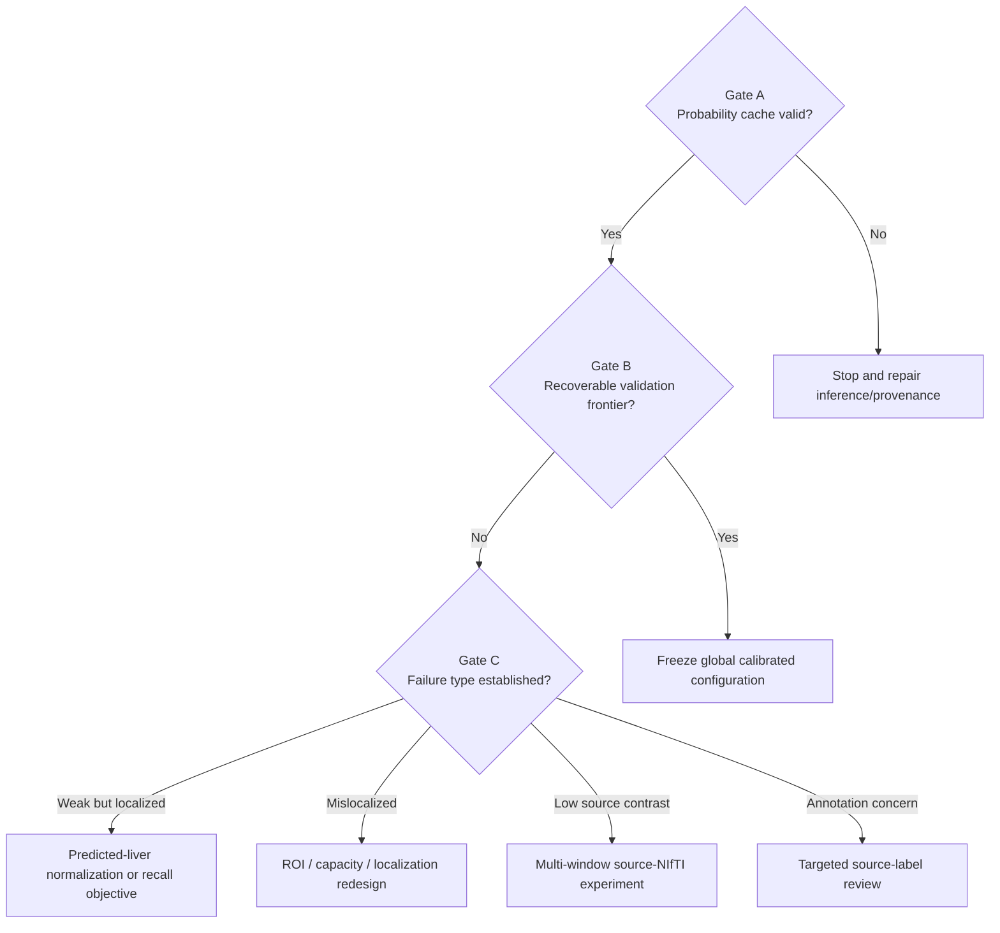

---

# Step 1 — Freeze provenance

## Objective

Prove that Mark 1 uses the exact dataset and checkpoint that produced the epoch-8 result.

## Required actions

1. Calculate manifest SHA-256.
2. Calculate checkpoint SHA-256.
3. Record notebook version or source hash.
4. Record Python, PyTorch, CUDA, GPU, NumPy, OpenCV, Matplotlib, SciPy, and pandas versions.
5. Record all thresholds, kernels, batch sizes, and random seeds before viewing results.
6. Confirm the test split cannot be constructed without explicit authorization.

## Required output

`mark_1_provenance.json`

Recommended fields:

```json
{
  "manifest_sha256": "...",
  "checkpoint_sha256": "...",
  "checkpoint_epoch": 8,
  "validation_slices": 10685,
  "validation_patients": 13,
  "random_seed": 42,
  "test_images_accessed": false
}
```

## Pass condition

- Manifest hash matches the corrected v2 manifest.
- Checkpoint loads strictly.
- Validation count is exactly `10,685`.
- Validation patient count is exactly `13`.
- Test remains locked.

---

# Step 2 — Verify data and model alignment

## Objective

Prevent a one-off diagnostic script from reintroducing pairing, orientation, channel, or shape errors.

## Required checks

- `sample_id` is unique.
- Every cached row retains `sample_id`, `volume_id`, and `slice_index`.
- Image, tumor mask, organ mask, liver probability, and tumor probability are exactly `256 × 256`.
- Model input is `[batch, 1, 256, 256]`.
- Model output is `[batch, 2, 256, 256]`.
- Tumor and liver probabilities are finite and inside `[0,1]`.
- Inference uses `model.eval()`.
- Inference uses `torch.inference_mode()`.
- Checkpoint loading uses `strict=True`.
- Validation loader uses no random augmentation.

## Alignment diagram

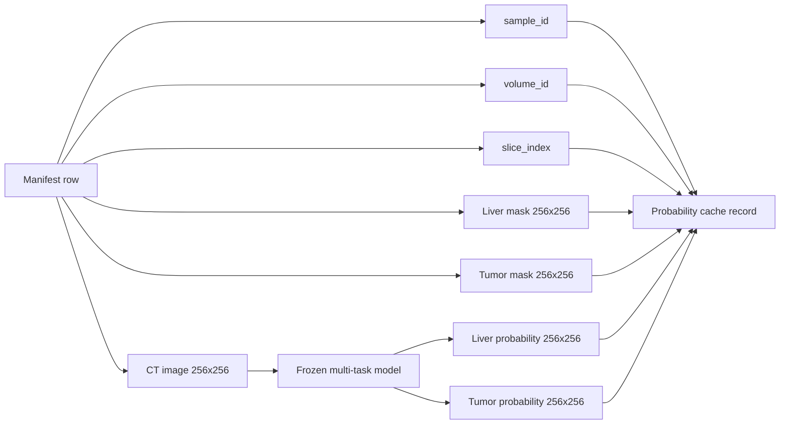

## Stop conditions

Stop immediately for:

- duplicate sample IDs;
- non-finite probability;
- checkpoint key mismatch;
- shape mismatch;
- missing validation slices;
- out-of-order or mismatched volume/slice identifiers;
- accidental test access.

---

# Step 3 — Run validation inference once

## Objective

Perform one deterministic forward pass and avoid repeating GPU inference for every threshold.

## Recommended settings

- Batch size: `16–32`, selected according to available GPU memory and temperature.
- No gradients.
- No augmentation.
- Existing image-only robust normalization.
- CUDA mixed precision may be used only if it reproduces the saved validation behavior.
- Thermal check before inference.
- Periodic progress logging.

## Inference architecture

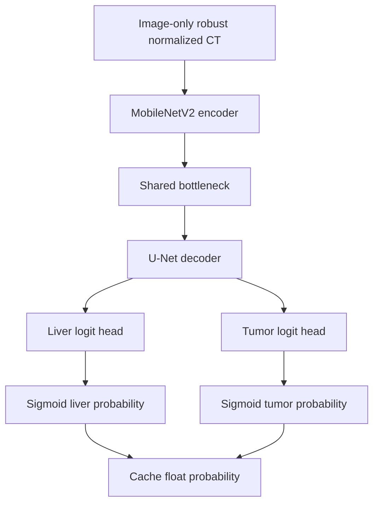

## Thermal controls

- Desired start: below `84°C`.
- Cooldown poll: 30 seconds.
- Emergency limit: `90°C`.
- Save progress after each completed volume.
- Do not discard completed volume caches after interruption.

---

# Step 4 — Cache raw probabilities

## Objective

Allow all thresholds, metrics, graphs, and bootstrap analyses to be recomputed without rerunning the model.

## Cache design

Recommended volume-level files:

```text
mark_1_outputs/
└── probability_cache/
    ├── volume_104.npz
    ├── volume_116.npz
    ├── volume_108.npz
    └── ...
```

Each cache should include:

- `sample_id`
- `slice_index`
- `image` or a traceable image path
- `tumor_truth`
- `organ_truth` for diagnostic grouping only
- `liver_probability`
- `tumor_probability`

Ground-truth organ masks may be used to classify pixels for analysis. They must not be used to create the reported prediction.

## Precision choice

- Prefer `float16` or losslessly compressed `float32` for probabilities.
- Avoid `uint8` if fine calibration near low thresholds is important.
- Record cache dtype and quantization explicitly.

## Cache validation

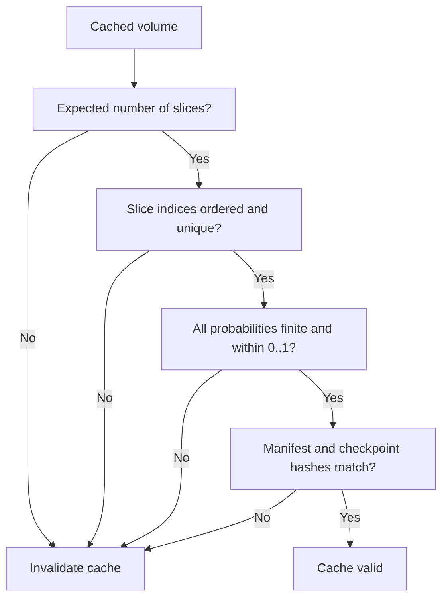

---

# Step 5 — Inspect probability localization

## Objective

Classify missed tumors as:

- correctly localized but weak;
- spatially misplaced;
- absent signal.

## Priority patients

1. Volume 104 — normalization/domain-sensitive.
2. Volume 116 — persistent large-tumor failure.
3. Volumes 108–110 — stronger reference patients.
4. Q1 smallest-lesion examples.
5. Tumor-negative volumes 105, 106, 114, and 115.

## Required per-slice panels

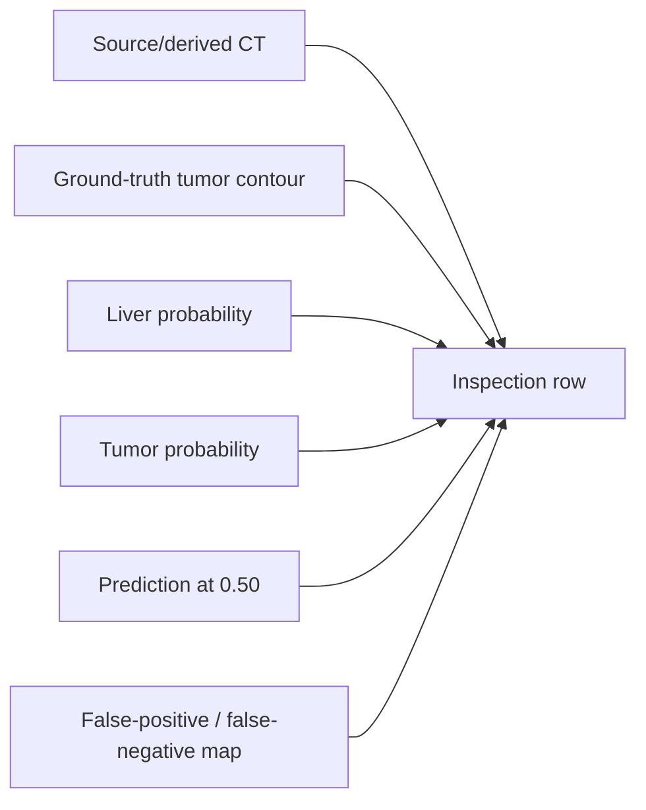

Plot requirements:

- Fixed probability scale: `vmin=0`, `vmax=1`.
- Ground-truth tumor shown as a contour, not an opaque filled mask.
- Same color map across patients.
- Include sample ID, volume ID, slice index, true pixels, maximum tumor probability, and mean probability inside truth.
- Do not auto-scale each probability map.

## Required slice selection

For volumes 104 and 116:

- largest tumor slice;
- median-burden tumor slice;
- lowest-burden positive slice;
- slice with highest tumor probability inside truth;
- slice with lowest tumor probability inside truth;
- representative false-positive empty slice.

For Q1:

- at least 12 positive slices covering multiple patients.

---

# Step 6 — Measure source-NIfTI HU contrast

## Objective

Determine whether volume 116 and other failures contain insufficient tumor-to-liver contrast in the input signal.

## Important rule

Actual HU analysis must use source NIfTI values. Do not call normalized PNG intensities “HU”.

## Per-slice measurements

For every tumor-positive slice:

- mean tumor HU;
- median tumor HU;
- mean liver-background HU;
- median liver-background HU;
- tumor minus liver-background mean;
- tumor minus liver-background median;
- robust pooled standard deviation;
- standardized contrast/effect size;
- tumor pixel count;
- volume ID and slice index.

Liver background means:

`organ mask AND NOT tumor mask`

## Contrast architecture

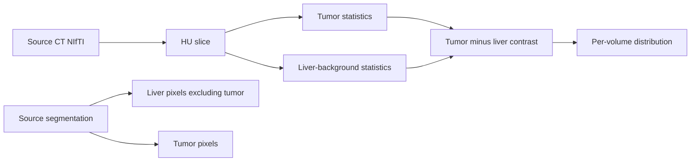

## Required graphs

- Per-volume boxplot or violin plot of tumor-liver contrast.
- Volumes 104 and 116 highlighted.
- Training distribution versus validation patients.
- Tumor burden versus contrast scatter.
- Contrast versus best achievable tumor probability.
- Contrast versus slice Dice at multiple thresholds.

## Interpretation

- Near-zero contrast plus low probabilities suggests an input-signal/windowing limitation.
- Adequate contrast plus low probabilities suggests representation/training failure.
- Adequate contrast plus correctly localized weak probabilities suggests calibration.
- Abnormal label morphology suggests targeted annotation review.

---

# Step 7 — Global tumor-threshold sweep

## Objective

Determine whether recall can be recovered by one global threshold.

## Coarse grid

```text
0.05
0.10
0.15
0.20
0.30
0.40
0.50
0.60
0.70
```

## Fine grid

After the coarse results are saved, add `0.02` increments only around the transition interval.

Example:

```text
0.14, 0.16, 0.18, 0.20, 0.22, 0.24, 0.26
```

The fine interval must be recorded before inspecting its detailed results.

## Prohibited approach

Do not select a different threshold for volume 104, volume 116, Q1 lesions, or any individual patient.

## Metrics per threshold

- Global Dice.
- Pixel precision.
- Pixel recall.
- Mean patient Dice.
- Median patient Dice.
- Patient Dice IQR.
- Worst positive-patient Dice.
- Volume 104 Dice.
- Volume 116 Dice.
- Q1–Q4 detection.
- Positive predicted-empty percentage.
- Empty-slice false-positive percentage.
- Predicted tumor volume.

## Threshold analysis diagram

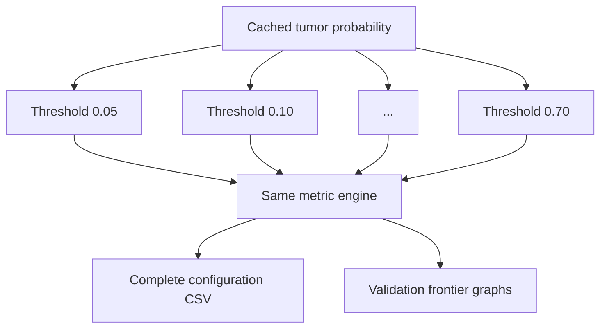

---

# Step 8 — Predicted-liver support sweep

## Objective

Measure whether stricter predicted-liver support removes any tumor predictions and whether it improves the recall/false-positive frontier.

## Liver thresholds

Recommended coarse grid:

```text
0.30
0.40
0.50
0.60
0.70
```

## Dilation settings

```text
No dilation / kernel 1
Kernel 5
Kernel 11
Kernel 21
Kernel 31
```

Do not use a literal kernel size `0`; represent “no dilation” explicitly or with kernel 1.

## Prediction rule

```text
tumor_prediction =
    tumor_probability >= tumor_threshold
    AND
    dilated_predicted_liver_support
```

## Additional measurements

- Pixels in raw tumor prediction.
- Pixels retained after liver support.
- Percentage removed.
- True-positive pixels removed.
- False-positive pixels removed.
- Per-patient removal rate.

If every configuration removes approximately zero pixels, binary liver support is conclusively not useful for the current checkpoint.

## Search size

Coarse maximum:

- 9 tumor thresholds.
- 5 liver thresholds.
- 5 dilation settings.
- Raw and gated reporting.

This produces up to `225` gated configurations plus the raw threshold baseline.

The search must be vectorized over cached arrays. It must not rerun neural-network inference per configuration.

---

# Step 9 — Probability distributions and patient uncertainty

## Pixel-population histograms

For each priority volume, compare:

1. True tumor pixels.
2. Liver background pixels.
3. Extra-liver pixels.

Plotting rules:

- 50 fixed bins over `[0,1]`.
- Density normalization.
- Logarithmic y-axis.
- Deterministic background subsampling.
- Same bin edges and axes for all patients.
- Report pixel counts even when plotting densities.

## Probability-distribution diagram

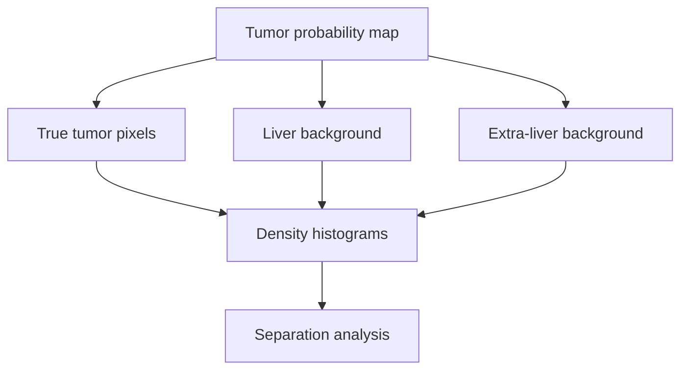

## Bootstrap uncertainty

Validation contains only 13 patients. Point estimates are unstable.

For the top configurations:

- Resample 13 validation patients with replacement.
- Use 1,000 bootstrap iterations.
- Seed: `42`.
- Recompute mean positive-patient Dice.
- Report 2.5th, 50th, and 97.5th percentiles.
- Also report median and IQR across the original 13 patients.

Bootstrap does not create new independent patients. It estimates uncertainty under the current validation composition.

---

# Step 10 — Classify failure and choose Mark 2

## Failure categories

### Category A — Correctly localized but weak

Evidence:

- Probability heat is centered on true tumor.
- Lower threshold recovers overlap.
- Background separation remains usable.

Next action:

- Freeze a global calibrated threshold if all targets pass.
- Otherwise test a stable false-negative-sensitive objective.

### Category B — Spatially misplaced

Evidence:

- High probabilities occur away from tumor.
- Lower thresholds mostly add false positives.

Next action:

- Predicted-liver ROI model.
- Higher-capacity encoder.
- Attention/deep supervision.
- Localization-focused auxiliary objective.

### Category C — Low source contrast

Evidence:

- Tumor-liver HU contrast near zero.
- Probability maps show little or no tumor signal.

Next action:

- Controlled multi-window NIfTI build.
- Narrow liver-lesion window plus current window as separate channels.
- Do not apply another window to existing PNGs.

### Category D — Annotation/morphology irregularity

Evidence:

- Diffuse or unusual annotation.
- Source overlay differs substantially from training morphology.

Next action:

- Targeted manual review.
- Document phenotype.
- Consider morphology-aware sampling only after label validity is confirmed.

## Decision tree

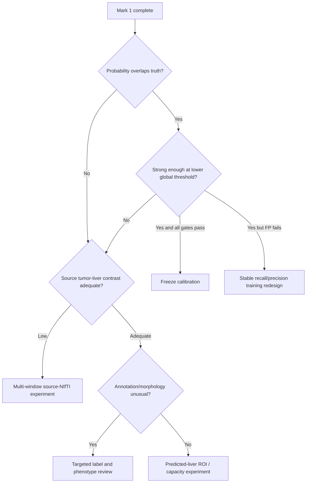

---

# Analysis dashboard design

## Dashboard 1 — Provenance and coverage

Panels:

1. Manifest/checkpoint hash table.
2. Validation slice coverage by volume.
3. Positive-slice counts by volume.
4. Cache size and dtype.
5. Finite-probability check.
6. Test-lock status.

## Dashboard 2 — Probability localization

Panels:

1. Volume 104 heatmaps.
2. Volume 116 heatmaps.
3. Strong-patient reference heatmaps.
4. Q1 examples.
5. False-positive empty slices.
6. Raw versus liver-supported masks.

## Dashboard 3 — Calibration frontier

Panels:

1. Mean patient Dice versus tumor threshold.
2. Volume 104/116 Dice versus threshold.
3. Q1 detection versus threshold.
4. Positive predicted-empty versus threshold.
5. Empty-slice FP versus threshold.
6. Precision-recall curve.

## Dashboard 4 — Patient variability

Panels:

1. Per-patient Dice heatmap across thresholds.
2. Median and IQR by threshold.
3. Bootstrap 95% intervals.
4. Patient ranking.
5. Tumor burden versus Dice.
6. Contrast versus Dice.

## Dashboard 5 — Expected versus actual

Target matrix:

| Metric | Required |
|---|---:|
| Mean patient Dice | `≥0.406915` |
| Volume 104 Dice | `≥0.50` |
| Volume 116 Dice | `≥0.05` |
| Q1 detection | `≥45%` |
| Positive predicted-empty | `≤20%` |
| Empty-slice FP | `≤15%` |

Use:

- blue for pass;
- orange for miss;
- exact actual values;
- no misleading truncated magnitude bars;
- explicit note that configuration selection used validation data.

---

# Required Mark 1 output files

```text
mark 1/
├── MARK_1_EXECUTION_BLUEPRINT.md
└── mark_1_outputs/
    ├── mark_1_provenance.json
    ├── mark_1_status.json
    ├── probability_cache/
    │   ├── volume_104.npz
    │   ├── volume_116.npz
    │   └── ...
    ├── cache_coverage.csv
    ├── probability_slice_statistics.csv
    ├── probability_volume_statistics.csv
    ├── hu_contrast_per_slice.csv
    ├── hu_contrast_per_volume.csv
    ├── calibration_configuration_results.csv
    ├── calibration_patient_metrics.csv
    ├── calibration_size_metrics.csv
    ├── bootstrap_confidence_intervals.csv
    ├── mark_1_gate_result.json
    ├── provenance_dashboard.png
    ├── probability_localization_104.png
    ├── probability_localization_116.png
    ├── probability_population_histograms.png
    ├── hu_contrast_dashboard.png
    ├── calibration_frontier_dashboard.png
    ├── patient_threshold_heatmap.png
    ├── bootstrap_uncertainty.png
    └── expected_vs_actual_dashboard.png
```

## Status file

`mark_1_status.json` should record:

- last completed step;
- cache completeness;
- volumes processed;
- configurations evaluated;
- test access status;
- thermal interruption status;
- errors;
- next resumable action.

---

# Mark 1 acceptance gate

## Calibration success

Mark 1 can authorize freezing a calibrated configuration only if one global configuration simultaneously reaches:

- Mean patient Dice `≥0.406915`.
- Volume 104 Dice `≥0.50`.
- Volume 116 Dice `≥0.05`.
- Q1 detection `≥45%`.
- Positive predicted-empty `≤20%`.
- Empty-slice false positives `≤15%`.
- Test images accessed: false.

## Diagnostic success

Even if calibration fails, Mark 1 passes as a diagnostic phase if:

- all validation probabilities are cached and verified;
- volumes 104 and 116 are visually and quantitatively classified;
- source-HU contrast is measured correctly;
- the full threshold/liver-support sweep is saved;
- patient bootstrap uncertainty is reported;
- the next failure category is selected with evidence;
- no test data is accessed.

## Gate result shape

```json
{
  "status": "mark_1_diagnostic_complete",
  "calibration_gate_passed": false,
  "failure_category": "weak_localized_or_low_contrast",
  "selected_global_configuration": null,
  "targets_passed": 0,
  "manifest_sha256": "...",
  "checkpoint_sha256": "...",
  "test_images_accessed": false,
  "next_mark": "multi_window_or_roi_ablation"
}
```

---

# Risks and controls

| Risk | Control |
|---|---|
| Validation overfitting from hundreds of configurations | Pre-register decision rule; save full sweep; use one global threshold |
| Per-patient tuning | Prohibited |
| Repeated GPU inference | Cache probabilities once |
| Cache/checkpoint drift | Hash both manifest and checkpoint |
| False HU claims from PNGs | Use source NIfTI for HU contrast |
| Histogram background dominance | Density normalization and deterministic subsampling |
| Probability-map visual deception | Fixed scale `0–1` |
| Empty-mask Dice inconsistency | Reuse established metric engine |
| NaN/Inf probabilities | Assert finiteness immediately |
| Shape or pairing error | Preserve and verify sample ID, volume ID, slice index |
| GPU overheating | Reuse thermal wait and partial saving |
| Test leakage | Explicit locked-loader assertion and status flag |

---

# Mark 1 work estimate

## Logical work units

| Work unit | Steps | Relative effort |
|---|---:|---|
| Provenance and validation | 1–2 | Low |
| Probability inference/cache | 3–4 | Medium |
| Probability visualization | 5 | Medium |
| Source HU analysis | 6 | Medium |
| Threshold/support sweep | 7–8 | Medium |
| Bootstrap/statistics | 9 | Low–medium |
| Decision report | 10 | Low |

## Compute profile

- Neural-network inference: one full validation pass.
- Threshold evaluation: CPU/vectorized from cache.
- HU analysis: CPU and source-NIfTI I/O.
- Bootstrap: CPU.
- No backpropagation.
- No optimizer.
- No test inference.

## Completion definition

Mark 1 is complete when:

1. All ten steps finish.
2. All required CSV/JSON files are saved.
3. All five dashboards are produced.
4. Volume 104 and 116 failure types are documented.
5. A global calibration pass/fail decision is made.
6. Mark 2 is selected from evidence.

---

# Recommended Mark 2 branches

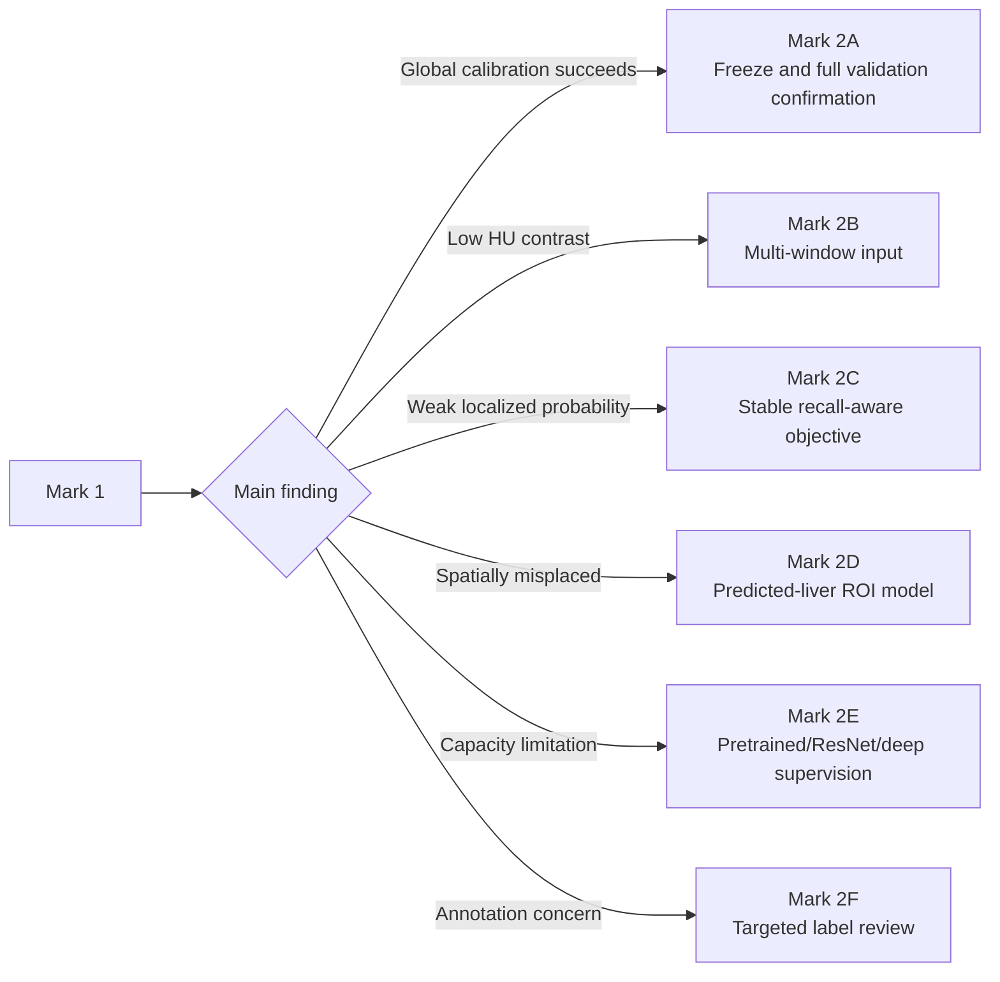

Only one Mark 2 branch should be selected as the next controlled experiment.

---

# Instructions for another chat or collaborator

When reviewing Mark 1, do not suggest a new architecture until the following are known:

1. Tumor-probability distribution inside true tumors for volumes 104 and 116.
2. Spatial localization of their maximum probabilities.
3. Tumor-to-liver HU contrast from source NIfTI.
4. Global threshold frontier.
5. Whether predicted-liver support removes any true or false pixels.
6. Bootstrap uncertainty across 13 validation patients.

The main requested decision is:

> Is the current failure primarily calibration, normalization/windowing, localization, capacity, or annotation/morphology?

The answer must be supported by saved Mark 1 artifacts, not only visual intuition.

