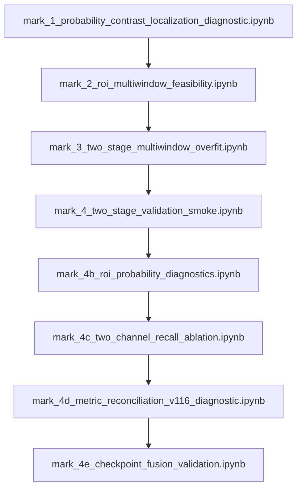

# Mark 1 Research & Benchmark Iteration Pipeline (Mark 1 → Mark 4E)

## Overview

This directory contains the primary research, model diagnostics, ROI feasibility studies, loss function ablations, and checkpoint fusion experiments executed on the LiTS-17 CT dataset.

The research evolved across **8 sequential iteration notebooks** (`Mark 1` through `Mark 4E`), concluding with the controlling **Mark 4E Checkpoint Fusion Policy**.

---

## Notebook Execution & Process Flow

### Execution Index & Purpose:

1. **[`mark_1_probability_contrast_localization_diagnostic.ipynb`](mark_1_probability_contrast_localization_diagnostic.ipynb)**:  
   * **Purpose**: Baseline diagnostic evaluating model output probabilities and contrast response.  
   * **Output Directory**: [`mark_1_outputs/`](mark_1_outputs/)  
   * **Key Finding**: Identified probability suppression on small hypodense tumors.

2. **[`mark_2_roi_multiwindow_feasibility.ipynb`](mark_2_roi_multiwindow_feasibility.ipynb)**:  
   * **Purpose**: Evaluated predicted-liver ROI crop bounding boxes and multi-window HU input feasibility.  
   * **Output Directory**: [`mark_2_outputs/`](mark_2_outputs/)  
   * **Key Finding**: Validated that Stage-1 ROI cropping reduces slice search area by ~58% without losing liver tissue.

3. **[`mark_3_two_stage_multiwindow_overfit.ipynb`](mark_3_two_stage_multiwindow_overfit.ipynb)**:  
   * **Purpose**: Deterministic overfit gate on 2-stage ROI segmentation pipeline.  
   * **Output Directory**: [`mark_3_outputs/`](mark_3_outputs/)  
   * **Key Metric**: Achieved hard micro-Dice **`0.900557`** after 17 epochs; **100%** tumor containment.

4. **[`mark_4_two_stage_validation_smoke.ipynb`](mark_4_two_stage_validation_smoke.ipynb)**:  
   * **Purpose**: 5-Epoch validation smoke training for generalization testing.  
   * **Output Directory**: [`mark_4_outputs/`](mark_4_outputs/)  
   * **Key Finding**: High positive predicted-empty rate (`36.85%`) on validation slices.

5. **[`mark_4b_roi_probability_diagnostics.ipynb`](mark_4b_roi_probability_diagnostics.ipynb)**:  
   * **Purpose**: Global probability threshold sweep (0.05–0.70).  
   * **Output Directory**: [`mark_4b_outputs/`](mark_4b_outputs/)  
   * **Key Finding**: Threshold-only tuning could not reduce predicted-empty rate below 35% without triggering high false positive rates.

6. **[`mark_4c_two_channel_recall_ablation.ipynb`](mark_4c_two_channel_recall_ablation.ipynb)**:  
   * **Purpose**: Two-channel broad+liver window input & Recall-Aware Loss ablation.  
   * **Output Directory**: [`mark_4c_outputs/`](mark_4c_outputs/)  
   * **Key Finding**: Two-channel input collapsed on tumor-positive patients; Recall Loss improved recall metrics but damaged volume `V116`.

7. **[`mark_4d_metric_reconciliation_v116_diagnostic.ipynb`](mark_4d_metric_reconciliation_v116_diagnostic.ipynb)**:  
   * **Purpose**: Metric reconciliation across 9 tumor-positive validation patients & `V116` failure diagnosis.  
   * **Output Directory**: [`mark_4d_outputs/`](mark_4d_outputs/)  
   * **Key Finding**: Discovered that all `152,763` tumor pixels of `V116` were inside the ROI; failure was due to hypodense domain response, not ROI clipping.

8. **[`mark_4e_checkpoint_fusion_validation.ipynb`](mark_4e_checkpoint_fusion_validation.ipynb)**:  
   * **Purpose**: Fixed Checkpoint Fusion Policy evaluation: $P_{\text{fused}} = \max(P_{\text{control}}, P_{\text{recall\_loss}})$.  
   * **Output Directory**: [`mark_4e_outputs/`](mark_4e_outputs/)  
   * **Key Metric**: **PASSED ALL 6 VALIDATION TARGETS** at threshold `0.70` (Mean Dice `0.3771`, Q1 Detection `50.57%`, FP `5.55%`).

---

## Directory Output Index

- [`mark_1_outputs/`](mark_1_outputs/): Diagnostic probability arrays & baseline statistics.
- [`mark_2_outputs/`](mark_2_outputs/): Multi-window ROI crop manifests & spatial bounding box logs.
- [`mark_3_outputs/`](mark_3_outputs/): Overfit model weights (`broad_1ch_overfit.pth`) & containment logs.
- [`mark_4_outputs/`](mark_4_outputs/): Control model weights (`mark_4_best.pth`) & 5-epoch logs.
- [`mark_4c_outputs/`](mark_4c_outputs/): Recall-loss model weights (`recall_loss_best.pth`).
- [`mark_4d_outputs/`](mark_4d_outputs/): Probability cache arrays (`probability_cache/volume_*.npz`).
- [`mark_4e_outputs/`](mark_4e_outputs/): Final fusion gate JSON report (`mark_4e_gate_result.json`).

---

[Back to Root README](../README.md) | [Next Phase: Mark 1 (Part 2)](../mark%201%20(part%202)/README.md)
