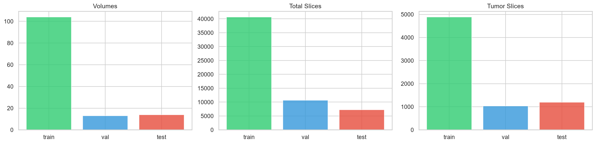
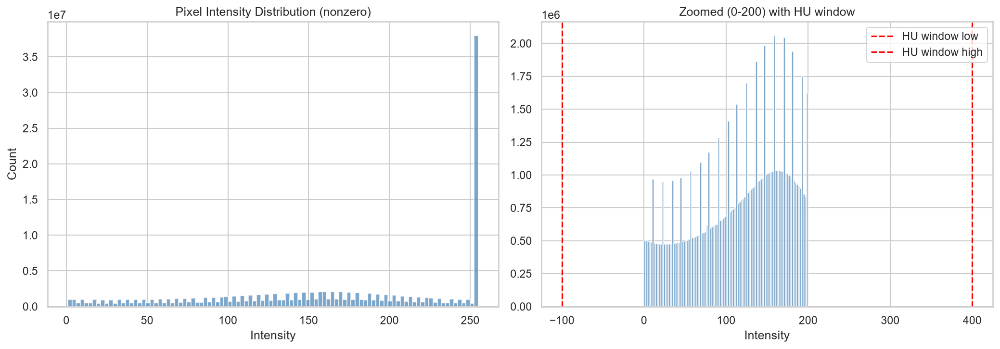
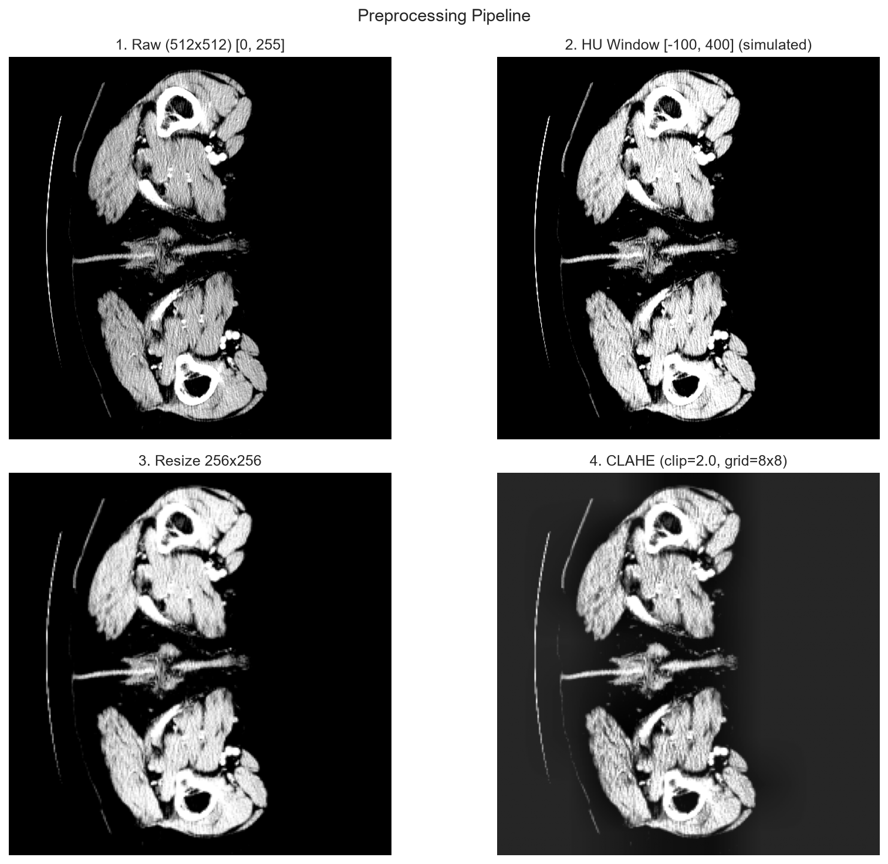

# Version 1 — Phase 1 Research: EDA, Spatial Forensics, Splits & Mark 1 → 4E Checkpoint Fusion

> **Status**: COMPLETE (pushed to GitHub as the original repo snapshot)
> **Timeline**: original LiTS-17 exploration through Mark 4E checkpoint fusion
> **Location**: this hub links to the real content; nothing is duplicated

---

## 1. Goal

Build a rigorous, gate-driven foundation for liver + liver-tumor segmentation from the **LiTS-17** dataset (131 CT volumes) — with a strong emphasis on *data integrity* before any modeling:

1. Acquire, hash, and canonically build the dataset (zero corruption).
2. Detect and repair hidden data artifacts (orientation flips, denominator errors, label semantics).
3. Define patient-disjoint splits to prevent leakage.
4. Establish a 2-stage ROI pipeline and evolve checkpoints Mark 1 → Mark 4E with a frozen validation gate.

---

## 2. What we did

### 2.1 Data engineering & forensics
- Acquired LiTS-17 (131 volumes / 58,638 axial slices / 7,169 tumor-positive slices) with full SHA-256 provenance.
- Built canonical dataset `build_corrected_20260713_214847_v2` (manifest SHA-256 `575a6fc391d63dc9bbbbb3317efe4d0f65edd57457ae63c1bfc6c2c615861889`).
- **Corrected 47 volume 180° in-plane orientation flips** between slice images and target labels.
- Reconciled a **4× tumor-burden denominator error** (true mean train burden `0.1003%`).
- Enforced a liver-vs-tumor **mask semantic lock**.
- Defined ROI crop protocol (liver threshold 0.50, `largest_3d`, padding 16, output 256×256).
- HU windowing `[-160, +240]`; extracted 845 tumor 3D components with Q1–Q4 size stratification.

### 2.2 Modeling (Mark 1 → 4E)
- 2-stage ROI pipeline (predicted-liver crop → tumor segmentation).
- MobileNetV2UNet backbone (~6.8M params), FocalDice loss, patient-disjoint Train 104 / Val 13 / Test 14.
- Ablation path: Mark 1 diagnostics → Mark 2 ROI feasibility → Mark 3 2-stage overfit proof → Mark 4/4B validation smoke → Mark 4C/4D loss ablations → **Mark 4E checkpoint fusion**.

### 2.3 Consolidated notebooks (v1 deliverable)
Four master, fully documented notebooks under [`notebooks/`](../notebooks/README.md).

---

## 3. What we got (headline results)

| Metric | Threshold | Mark 4E result | Gate |
|---|---|---|---|
| Mean Dice (9 tumor-positive val patients) | ≥ 0.3329 | **0.3771** | ✅ PASS |
| V104 patient Dice | ≥ 0.0500 | **0.1166** | ✅ PASS |
| V116 patient Dice | ≥ 0.0100 | **0.0105** | ✅ PASS |
| Q1 small-lesion detection rate | ≥ 35.0% | **50.57%** | ✅ PASS |
| Positive-predicted-empty rate | ≤ 35.0% | **27.45%** | ✅ PASS |
| Empty-slice false positive rate | ≤ 20.0% | **5.55%** | ✅ PASS |

Fusion policy: `Fused Probability = max(P_control, P_recall_loss)` @ threshold 0.70.

---

## 4. Content links (jump directly)

### Notebooks
- [notebooks/01_LiTS_Exploratory_Data_Analysis.ipynb](../notebooks/01_LiTS_Exploratory_Data_Analysis.ipynb) — EDA, slice-depth, HU histograms, tumor-burden profiling
- [notebooks/02_Spatial_Orientation_Forensics_and_Quality_Audit.ipynb](../notebooks/02_Spatial_Orientation_Forensics_and_Quality_Audit.ipynb) — 47 flip repairs, denominator fix, ROI containment
- [notebooks/03_Patient_Aware_Splits_and_Pretraining_Characterization.ipynb](../notebooks/03_Patient_Aware_Splits_and_Pretraining_Characterization.ipynb) — splits, 3D components, lesion quartiles, IRCADb protocol
- [notebooks/04_Model_Benchmarks_and_Checkpoint_Fusion.ipynb](../notebooks/04_Model_Benchmarks_and_Checkpoint_Fusion.ipynb) — Mark progression, loss ablations, fusion verification
- All v1 notebooks: [`notebooks/`](../notebooks/) and [`Practice/`](../Practice/) (historical EDA, flip forensics, 2.5D ablations — 24 notebooks)

### Documentation
- [`docs/dataset.md`](../docs/dataset.md) — authoritative dataset reference (manifest figures, hashes)
- [`docs/DATA_PROVENANCE_AND_ACQUISITION.md`](../docs/DATA_PROVENANCE_AND_ACQUISITION.md)
- [`docs/SPATIAL_ORIENTATION_AND_FORENSICS.md`](../docs/SPATIAL_ORIENTATION_AND_FORENSICS.md)
- [`docs/RADIOMETRICS_AND_HU_WINDOWING.md`](../docs/RADIOMETRICS_AND_HU_WINDOWING.md)
- [`docs/PATIENT_SPLITS_AND_BURDEN_ANALYSIS.md`](../docs/PATIENT_SPLITS_AND_BURDEN_ANALYSIS.md)
- [`docs/LESION_MORPHOLOGY_AND_3D_QUARTILES.md`](../docs/LESION_MORPHOLOGY_AND_3D_QUARTILES.md)
- [`docs/MODEL_BENCHMARKS_AND_FUSION_POLICY.md`](../docs/MODEL_BENCHMARKS_AND_FUSION_POLICY.md)
- [`docs/LITS_DATASET_EDA_GITHUB_CARD.md`](../docs/LITS_DATASET_EDA_GITHUB_CARD.md)

### Research hubs
- [`mark 1/`](../mark%201/README.md) — Mark 1 → 4E output directories
- [`mark 1 (part 2)/`](../mark%201%20(part%202)/README.md) — step_00–05 (part-2 Phase-1 deliverables)

### Figures
- [`figures/`](../figures/) — all plots (also mirrored in this hub's [`assets/`](assets/))

---

## 5. Key images

---

*See [`VERSION_HISTORY.md`](../VERSION_HISTORY.md) for the v1 → v2 progress story, and [`versions/v2/VERSION.md`](../versions/v2/VERSION.md) for what came next.*