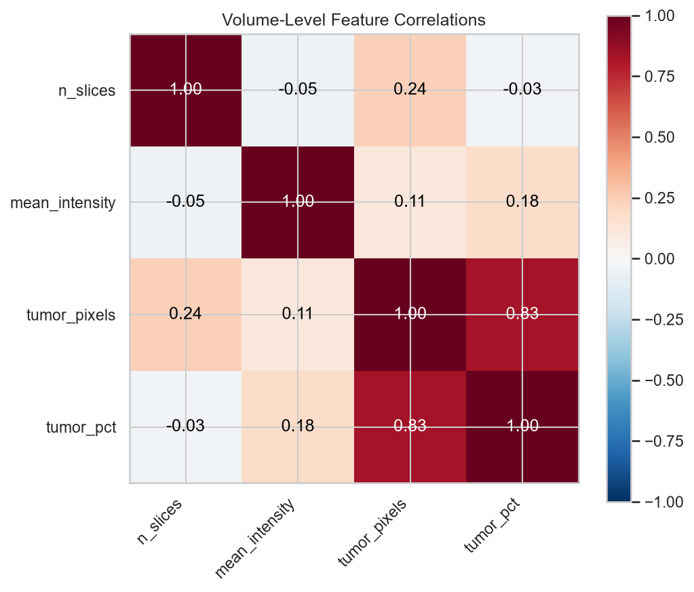
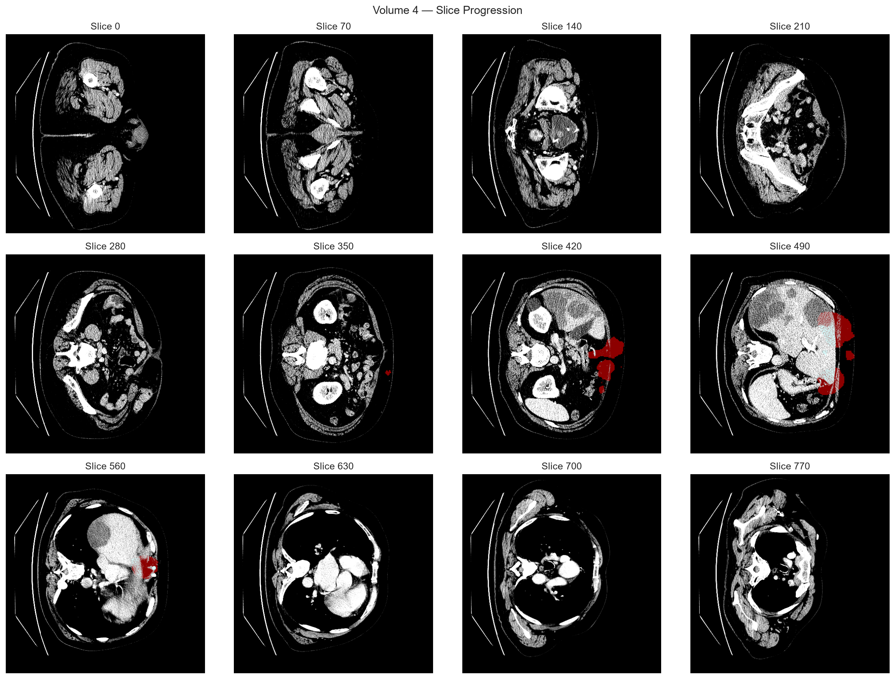

# Version 2 — Phase 2: Reproducible Evaluation Suite, External Validation (3D-IRCADb) & Storage Recovery

> **Status**: ACTIVE (current working state)
> **Timeline**: continues from v1 (Mark 4E) → full part-2 step_00–21 pipeline → external evaluation → cleanup
> **Location**: this hub links to the real content; nothing is duplicated

---

## 1. Goal

Turn v1's results into a **locked, reproducible, externally validated** pipeline:

1. Re-run and reproduce every Mark 1 → 4E result through a formal Evaluation suite (notebooks 00–12).
2. Freeze part-2 contracts (steps 00–21): inference policy, one-time locked test evaluation, external evaluation.
3. Validate generalization on **3D-IRCADb-01** (20 anonymized patients) — out-of-domain clinical external check.
4. Make the repository lean and regenerable (removed ~41 GB of caches/dead weights; every deleted artifact has a regeneration recipe).

---

## 2. What we did

### 2.1 Reproducible evaluation suite
- [`Evaluation/`](../Evaluation/README.md) — 14 notebooks (00–12) that reproduce all Mark results, caches, and mirrors deterministically (REUSE mode).

### 2.2 Part-2 frozen pipeline (steps 00–21)
- [`mark 1 (part 2)/`](../mark%201%20(part%202)/README.md)
- step_00–05: model improvement, characterization, fusion/inference freeze, one-time locked test evaluation, final research package.
- step_06–11: manuscript readiness, evidence scaffold, venue selection, internal peer review, related-work evidence, owner submission gate.
- step_12–21: **external evaluation** — public dataset audit, 3D-IRCADb ingestion & QC, normalized conversion & parity QC, frozen external contract, one-time external evaluation, evidence validation, source-label concordance, manuscript integration, citation verification, terminal evidence chain & handoff.

### 2.3 External validation — 3D-IRCADb-01
- 20 public CT scans, ~2,827 slices, un-tuned out-of-domain clinical validation contract.
- Full evidence chain in step_13 → step_21 outputs (csv/json/png/signatures), documented in [`docs/EXTERNAL_VAL_3D_IRCADB.md`](../docs/EXTERNAL_VAL_3D_IRCADB.md).

### 2.4 Project governance & storage recovery
- [`PROGRESS.md`](../PROGRESS.md) — single source of truth for state/achievements.
- [`docs/REPRODUCTION_AND_REGENERATION.md`](../docs/REPRODUCTION_AND_REGENERATION.md) — regeneration map for every deleted heavy artifact.
- [`docs/BACKUP_CHECKPOINT_CACHE_INVENTORY.md`](../docs/BACKUP_CHECKPOINT_CACHE_INVENTORY.md) — SHA-256 metadata of all checkpoints/caches.
- **~41 GB freed** across passes (duplicate pruning, regenerable outputs, env/caches, IRCADb raw DICOM, backup zips, git gc).
- Test suite: **243/243 passing**.

---

## 3. What we got

| Item | Result |
|---|---|
| Evaluation reproduction | All Mark 1–4E results reproduced by `Evaluation/00–12` |
| Mark 4E fusion (v1 headline) | Dice 0.3771 / Q1 50.57% / ES-FP 5.55% — re-verified in v2 |
| External validation | 3D-IRCADb-01 contract frozen (step_15), one-time evaluation executed (step_16), evidence validated (steps 17–21) |
| Test suite | **243/243 passing** |
| Storage recovery | **~41 GB freed**, all regenerable (recipes documented) |

---

## 4. Content links (jump directly)

### Evaluation suite (reproduction)
- [`Evaluation/00_pipeline_overview_and_setup.ipynb`](../Evaluation/00_pipeline_overview_and_setup.ipynb) → 01 … 12
- [`Evaluation/README.md`](../Evaluation/README.md) — suite overview and run order

### Part-2 pipeline
- [`mark 1 (part 2)/README.md`](../mark%201%20(part%202)/README.md)
- External evaluation evidence (steps 12–21): [`step_13`](../mark%201%20(part%202)/step_13_3d_ircadb_ingestion_and_qc/), [`step_14`](../mark%201%20(part%202)/step_14_3d_ircadb_normalized_conversion_and_parity_qc/), [`step_15`](../mark%201%20(part%202)/step_15_frozen_external_evaluation_contract/), [`step_16`](../mark%201%20(part%202)/step_16_one_time_external_evaluation_after_explicit_authorization/), [`step_17`](../mark%201%20(part%202)/step_17_external_evaluation_evidence_validation_and_data_card/) … [`step_21`](../mark%201%20(part%202)/step_21_terminal_evidence_chain_and_project_handoff/)

### Governance & recovery
- [`PROGRESS.md`](../PROGRESS.md) — master state record
- [`docs/REPRODUCTION_AND_REGENERATION.md`](../docs/REPRODUCTION_AND_REGENERATION.md)
- [`docs/BACKUP_CHECKPOINT_CACHE_INVENTORY.md`](../docs/BACKUP_CHECKPOINT_CACHE_INVENTORY.md)
- [`docs/EXTERNAL_VAL_3D_IRCADB.md`](../docs/EXTERNAL_VAL_3D_IRCADB.md)

### Documentation hub
- [`docs/README.md`](../docs/README.md) — full index (reference, methods, knowledge base, engineering records)

### Figures
- [`figures/`](../figures/) — all plots (also mirrored in this hub's [`assets/`](assets/))

---

## 5. Key images

---

*See [`VERSION_HISTORY.md`](../VERSION_HISTORY.md) for the full v1 → v2 story, and [`versions/v1/VERSION.md`](../versions/v1/VERSION.md) for where it all started.*